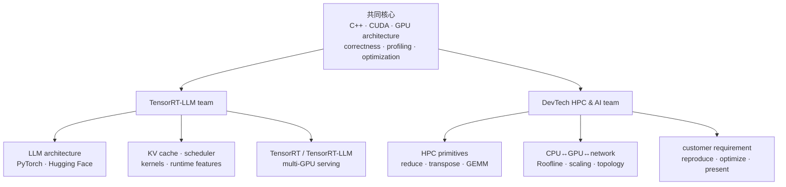

# 两个 NVIDIA team 的课程对齐

目标岗位：

1. [AI Computing Software Development Engineer, TensorRT-LLM](https://www.linkedin.com/jobs/view/4451457969/)
2. [Developer Technology Engineer, HPC and AI](https://www.linkedin.com/jobs/view/4397657019/)

这两个岗位的共同核心是 **C/C++/CUDA + architecture + profiling + performance optimization + 能把证据讲清楚**；分叉处是 TensorRT-LLM 更深入 LLM model/runtime，DevTech 更强调不同客户 workload、HPC/AI 广度与跨团队沟通。



## JD → 课程证据矩阵

| JD 能力 | 课程位置 | 面试前要拿得出的证据 |
|---|---|---|
| robust inference software / software design | labs、correctness harness、`cuda_check`、scheduler lab | odd-shape tests、错误处理、清楚的 ownership/API 设计 |
| LLM performance analysis/optimization | `docs/llm-inference/`、`docs/profiling/` | TTFT/TPOT/P99 + NSYS/NCU 的一份完整报告 |
| new LLM models/inference algorithms | MHA/GQA/MQA、paged KV、IFB、quant、speculative、P/D | 选一项读官方实现/论文，画 dataflow 并提出 A/B |
| implement kernels/runtime features | reduce/GEMM/pool/fusion + KV/scheduler labs | 两个 CUDA optimization ladders + 一个 scheduler feature PR 风格说明 |
| Python / PyTorch / Hugging Face | calculators、scheduler、`pytorch_hf_trace.py` | profiler trace、op/shape 表、`use_cache` A/B |
| C/C++ / GPU architecture / CUDA | Week 1–2、occupancy、PTX/SASS | 闭卷 kernel、memory hierarchy 图、stall 证据 |
| DL/HPC profiling/debugging | NSYS→NCU→Roofline→source/SASS | 从 symptom 到 bottleneck 的可证伪流程 |
| HPC/AI/data workload optimization | reduce、transpose、GEMM、pool、streams | bandwidth/compute/latency-bound 各一案例 |
| current/next platform reasoning | compute capability、Tensor Core、memory/communication model | 不背固定 speedup；按 GPU/版本重建 ceiling |
| customer problem solving | Day 21 双 capstone 口头/书面模板 | requirement→reproducer→baseline→change→result→limits |
| collaboration/English communication | 每日英文 5 句摘要、final 5-min talk | 一页英文 executive summary + technical appendix |

## 21 天时间分配

| 区块 | 天数 | 两个 team 的用途 |
|---|---:|---|
| CUDA 基础、reduce | 7 | kernel/runtime 与 HPC 共同底座 |
| transpose、GEMM、avg pool | 7 | memory hierarchy、算术强度、真实 operator |
| fusion、streams、profiling | 2 | end-to-end 与 kernel optimization |
| PyTorch/HF、LLM math/KV/scheduler | 3 | TensorRT-LLM 主轴；DevTech AI workload |
| TensorRT/TensorRT-LLM 与 capstone | 2 | deployment + 两岗位表达 |

## 两个 capstone 要各自怎么讲

### TensorRT-LLM team 版本

```text
Problem: 长 prompt + chat decode 混合时 P99 TPOT 变差
Reproducer: 固定 model/revision、length distribution、arrival rate
Model: weight/KV capacity + prefill/decode 工作形态
Evidence: scheduler counters + NSYS + dominant kernel/NCCL
Change: chunked prefill/token budget/quant/graph 中只选一个
Result: TTFT/TPOT/goodput/quality/memory
Feature thinking: API、test matrix、fallback、版本兼容、telemetry
```

### DevTech team 版本

```text
Customer goal: workload、平台、SLO/成本与限制
Reproducer: 最小正确案例 + representative scale
Model: CPU/GPU transfer、FLOPs、bytes、Roofline、Amdahl
Evidence: NSYS → NCU → source/PTX/SASS
Change: algorithm/data layout/kernel/library/overlap 中只选一个
Result: correctness、latency/throughput、scaling、跨 shape 稳定性
Communication: 一页结论、风险、可移植性与下一步
```

## 真实覆盖边界

三周能建立可面试、可实作的共同核心，但不能把 JD 中“所有 DL/ML/HPC/graphs/data analytics、GPU/CPU/DPU”都练到专家深度。这里把 graphs/data analytics/DPU 当作 **新 workload 的分析迁移题**，不是声称三周内掌握所有 domain：先画 data movement、建 CPU/GPU/communication baseline、找 ceiling，再决定 library/kernel/system 优化。面试时这样界定，比罗列没有实作的名词更可信。

## 最终通过标准

- TensorRT-LLM 模拟面：90 分钟，完成 KV 白板计算、scheduler 设计、CUDA kernel 诊断、LLM serving 系统题。
- DevTech 模拟面：90 分钟，完成 unknown workload 分解、Roofline、NSYS/NCU 证据、customer-facing 英文总结。
- 同一个 capstone 准备两种 5 分钟讲法；技术事实相同，取舍与受众不同。
