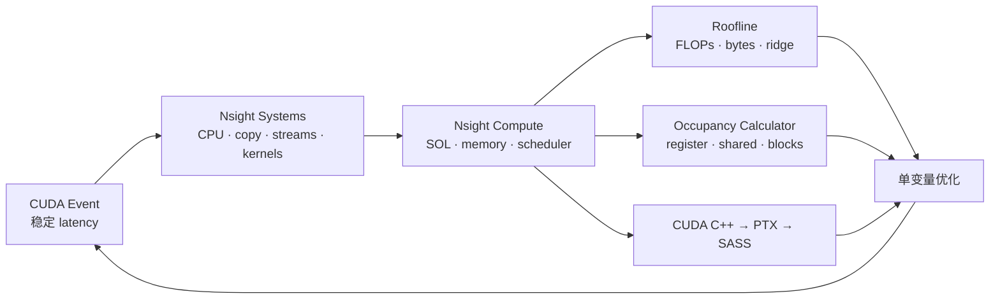
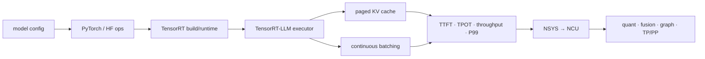

# CUDA Kernel Performance Lab

这是一套 **21 天 × 每天约 2 小时** 的实作课程。目标不是“看过 CUDA”，而是能独立完成下面这条闭环：

```text
写 CPU reference → 写 naive kernel → 测正确性 → CUDA Event 计时
→ 判断 memory/compute bottleneck → 做一项优化 → 用 profiler 证伪或证实
```

课程来自分享对话里的主线：execution model、memory hierarchy、coalescing、shared memory、bank conflict、warp shuffle、reduction、transpose、GEMM、occupancy、streams、Roofline 与 Nsight。这里的 “Shapley” 按上下文落实为 **shared memory**。Week 3 再把这些底层能力接到 PyTorch/Hugging Face、TensorRT、TensorRT-LLM、KV cache、continuous batching、量化与多 GPU inference。

课程已按两个目标岗位逐项映射：[NVIDIA TensorRT-LLM 与 DevTech HPC/AI 对齐表](JOB_ALIGNMENT.md)。共同核心会一起练；最后一个 capstone 分别用 inference-runtime 与 customer-workload 两种角度表达。

## 你会真的写出的东西

| 算子 | 自己实现的阶梯 | 主要概念 |
|---|---|---|
| Vector add | scalar → grid-stride → `float4` | indexing、coalescing、带宽 |
| Reduce sum | per-element atomic → shared tree → first-add → shuffle → vectorized | 同步、divergence、warp primitive |
| Transpose | strided → shared tile → padded tile | coalescing、bank conflict |
| GEMM | naive → shared tile → register tile → cuBLAS ceiling | reuse、arithmetic intensity、register pressure |
| Average pool | direct → shared input tile → specialized `float4` | halo、reuse、specialization |
| Bias + ReLU | two kernels → fused kernel | launch/traffic cost、fusion |
| Chunked vector op | sequential → multi-stream overlap | pinned memory、copy/compute overlap |

参考实现放在 `src/`，闭卷实作题放在 `labs/`。先做 lab 并让测试通过，再看对应 reference；不要一开始就抄答案。

## 最快开始

要求：Linux/WSL2、支持 CUDA 的 NVIDIA GPU、CUDA Toolkit（含 `nvcc`）、CMake ≥ 3.24、Ninja、Python 3。

```bash
make setup
make build
make test

# 跑一个完整正确性 + benchmark
./build/release/reduce_sum

# 只验正确性，适合每日提交前
./build/release/gemm --check-only

# profiler（脚本会把报告放到 out/）
./scripts/profile.sh reduce_sum
```

Windows + WSL2 推荐直接使用已经验证的 NGC container，不必在 WSL host 安装 CUDA Toolkit：

```bash
make docker-env
make docker-test
```

默认使用本机已有的 `nvcr.io/nvidia/pytorch:25.02-py3`；环境、单一命令、interactive shell 与 profiler 用法见 [Docker / NGC 指南](docs/docker.md)。

若 `CMAKE_CUDA_ARCHITECTURES=native` 在旧工具链不可用，RTX 4080 可显式配置：

```bash
cmake -S . -B build/release -G Ninja \
  -DCMAKE_BUILD_TYPE=Release -DCMAKE_CUDA_ARCHITECTURES=89
cmake --build build/release -j
```

## 如何跟课

1. 打开 [COURSE.md](COURSE.md)，每天只做当天栏位，控制在 120 分钟。
2. 开始前在 [progress/template.md](progress/template.md) 写预测；结束后补结果与证据。
3. 每个优化必须留下三件东西：correctness、计时、为什么快/没快的解释。
4. 每周末做闭卷重写；写不出来不往后“看更多”。

环境安装见 [docs/setup.md](docs/setup.md)，先用 [CUDA 图解](docs/visual-guide.md) 建立执行与 memory 直觉，再读 [性能心智模型](docs/mental-model.md)；完整的 NSYS → NCU → Roofline → PTX/SASS profiling 路线见 [docs/profiling.md](docs/profiling.md)，精选权威资料见 [docs/references.md](docs/references.md)。

## Profiling 学习地图



```bash
./scripts/profile_nsys.sh streams
./scripts/profile_ncu.sh reduce_sum v3 reduce_v3
./scripts/dump_code.sh reduce_sum

python3 tools/perf_calculator.py gemm \
  --m 1024 --n 1024 --k 1024 --traffic-model minimum
```

## LLM inference 学习地图

从 [LLM inference 总地图](docs/llm-inference/README.md) 开始；里面不是纯阅读，而是容量手算、KV lab、scheduler lab、PyTorch/HF trace、TensorRT shape matrix 与 TensorRT-LLM benchmark。



```bash
# 先手算再核对 KV 容量
python3 tools/llm_calculator.py kv \
  --layers 32 --kv-heads 8 --head-dim 128 \
  --dtype-bytes 2 --sequence 4096 --batch 8

# 看 static 与 iteration-level batching 的差异
python3 tools/batching_simulator.py \
  --lengths 2 8 3 6 1 --batch 2
```

## 仓库地图

```text
src/                 可运行的完整 reference 与 benchmark
include/course/      CUDA error check、RAII、计时与正确性工具
labs/                必须独立补齐的 kernel skeleton
labs/llm-inference/  KV、scheduler、PyTorch/HF trace 实作
docs/                知识补齐、profiling、面试验收
docs/llm-inference/  TensorRT / TensorRT-LLM / serving 完整路线
scripts/             环境检查与 Nsight 命令
progress/            每日实验记录模板
tools/               repo 检查、性能/LLM 计算器、batching simulator
```

## 完课标准

只有同时满足以下条件才算完成：

- `ctest --preset release` 全过；
- 不看 `src/`，能在 45 分钟内写出 block reduction（含 warp shuffle）；
- 不看 `src/`，能在 60 分钟内写出边界正确的 tiled GEMM；
- 能用一份 Nsight Compute 报告说明一个 kernel 是 memory-bound 还是 compute-bound；
- 对至少三个算子提交 `v0 → optimized` 数据，并说明优化为何有效或无效；
- 能解释 occupancy 为什么不是越高越快、何时 shared memory 会适得其反；
- 能闭卷算 weight/KV capacity，并实作 static 与 continuous scheduler；
- 能区分 TensorRT/TensorRT-LLM/Triton，并从 TTFT/TPOT/P99 下钻到 NSYS/NCU；
- 能把同一个实验分别讲成 TensorRT-LLM runtime feature 与 DevTech customer optimization case。
