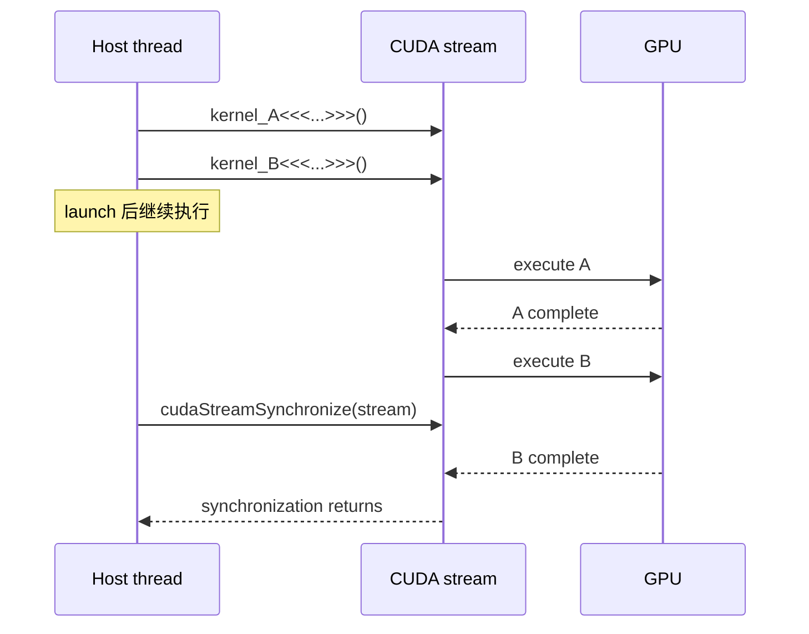
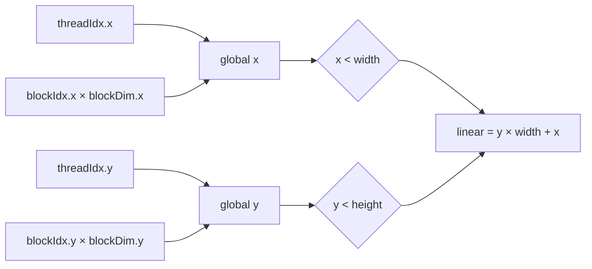
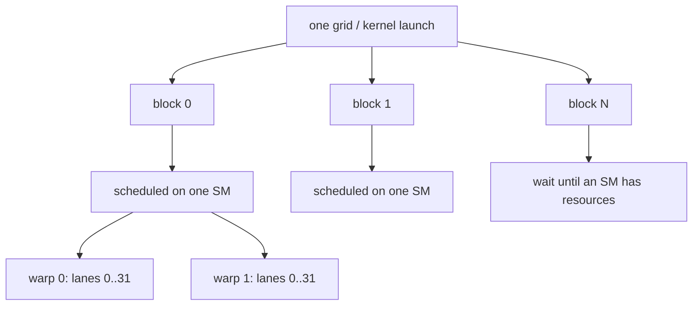

# CUDA Programming Model：从 `threadIdx` 到 synchronization

这是课程真正的起点。先把“谁执行、索引怎么算、谁能互相沟通、host 何时等 GPU”讲清楚，再进入 coalescing、shared memory 与优化。

## 1. Host、device 与 kernel launch

```cpp
__global__ void add(const float* a, const float* b, float* c, int n) {
  const int i = blockIdx.x * blockDim.x + threadIdx.x;
  if (i < n) c[i] = a[i] + b[i];
}

const int threads = 256;
const int blocks = (n + threads - 1) / threads;
add<<<blocks, threads>>>(d_a, d_b, d_c, n);
```

- `__global__`：函数从 host launch，在 device 执行。
- `<<<grid, block, shared_bytes, stream>>>`：指定 grid、block、dynamic shared memory 与 CUDA stream；后两项可省略。
- 一个 launch 产生一个 grid；grid 包含 blocks；block 包含 threads。
- kernel launch 对 host 通常是异步的。CPU 送出工作后可继续执行，直到遇到同步操作或依赖结果的 blocking operation。



同一个 stream 内有顺序；不同 streams 没有自动的数据依赖。需要顺序时使用 event、stream wait、显式同步或重新设计 ownership。

## 2. `threadIdx`、`blockIdx`、`blockDim`、`gridDim`

kernel 内每个 thread 都能读取这些 built-in coordinates：

| 变量 | 含义 | 对同一范围是否相同 |
|---|---|---|
| `threadIdx.{x,y,z}` | thread 在 block 内的坐标 | 每个 thread 可不同 |
| `blockIdx.{x,y,z}` | block 在 grid 内的坐标 | 同一 block 相同 |
| `blockDim.{x,y,z}` | 每个 block 的维度 | 通常整个 launch 相同 |
| `gridDim.{x,y,z}` | grid 的 block 维度 | 整个 launch 相同 |
| `warpSize` | warp lane 数；当前 CUDA GPU 通常为 32 | device 常量 |

### 一维 mapping

```text
global_x = blockIdx.x * blockDim.x + threadIdx.x
stride   = blockDim.x * gridDim.x
```

`N=100003`、`blockDim.x=256` 时：

```text
gridDim.x = ceil(100003 / 256) = 391
launch threads = 391 × 256 = 100096
```

因此必须写 `if (global_x < N)`；多出的 93 threads 是正常的 tail，不该碰数组。

### 二维 mapping

```cpp
const int x = blockIdx.x * blockDim.x + threadIdx.x;
const int y = blockIdx.y * blockDim.y + threadIdx.y;
if (x < width && y < height) {
  const int linear = y * width + x;
}
```



### block 内的 linear thread ID

3D block flatten 成一维时：

```text
local_thread_id
  = threadIdx.x
  + blockDim.x × (threadIdx.y + blockDim.y × threadIdx.z)

lane_id = local_thread_id % warpSize
warp_id = local_thread_id / warpSize
```

硬件组成 warp 时，`x` 维变化最快。设计 2D/3D block 时仍要用 flatten 公式判断哪些 threads 位于同一个 warp。

## 3. Grid、block、warp 与 SM



- 一个 block 从开始到结束只驻留在一个 SM。
- blocks 可用任何顺序运行；不能假设 `block 0` 一定先于 `block 1`。
- SM 可同时驻留多个 blocks/warps，受 registers、shared memory、thread/block slots 限制。
- warp 是执行与调度单位；一个 warp 内分支走不同路径会产生 divergence，路径通常被分开执行。
- “有很多 threads”不等于都在同一时刻运行；GPU 让 ready warps 交错执行来隐藏 latency。

## 4. Memory scope 与 lifetime

| memory | ownership/scope | lifetime | 常见用途 |
|---|---|---|---|
| register | 一个 thread | thread | accumulator、index、临时值 |
| local memory | 逻辑上一个 thread，物理上 device memory | thread | spill、大型 thread-private array |
| shared memory | 一个 block | block | tile、重排、block reduction |
| global memory | 整个 device/context 可寻址 | allocation | 输入输出、跨 kernel 状态 |
| constant memory | device read-only view | module/allocation | 小型、warp 内重复读取的常量 |

只有同一 block 能用普通 shared memory 直接合作。不同 blocks 间通信通常写 global memory，并以 kernel boundary 或特殊 cooperative mechanism 分阶段。

## 5. 为什么需要 synchronization

以下代码有 race：thread 1 可能在 thread 0 写入前读取 `tile[0]`。

```cpp
__shared__ int tile[256];
tile[threadIdx.x] = input[global_x];
output[global_x] = tile[(threadIdx.x + 1) % blockDim.x];  // race
```

正确的 block cooperation：

```cpp
__shared__ int tile[256];
tile[threadIdx.x] = input[global_x];
__syncthreads();
output[global_x] = tile[(threadIdx.x + 1) % blockDim.x];
```

`__syncthreads()` 同时提供：

1. block barrier：所有参与的存活 threads 到齐前，没有 thread 通过。
2. block 内所需的 memory ordering/visibility：barrier 前的相关 shared/global writes 可被 barrier 后的 block threads 正确观察。

### 最危险的错误：部分 threads 提前离开

```cpp
if (global_x >= n) return;  // tail threads leave
tile[threadIdx.x] = input[global_x];
__syncthreads();            // remaining threads may wait forever
```

有 block-wide barrier 时，先让所有 threads 参与必要的 cooperative load/barrier，再只对有效 threads 写 output：

```cpp
tile[threadIdx.x] = global_x < n ? input[global_x] : 0;
__syncthreads();
if (global_x < n) output[global_x] = consume(tile);
```

条件中的 `__syncthreads()` 只有在条件对整个 block 一致时才安全。

## 6. 各种 synchronization 不可互换

```mermaid
flowchart TD
  NEED[谁必须等待谁?] --> HOST{Host 等 GPU?}
  HOST -->|整个 device| DS[cudaDeviceSynchronize]
  HOST -->|一个 stream| SS[cudaStreamSynchronize]
  HOST -->|一个时间点| ES[cudaEventSynchronize]
  NEED --> DEV{Device threads?}
  DEV -->|同一 warp lanes| WS[__syncwarp(mask) / warp primitive]
  DEV -->|同一 block| BS[__syncthreads / cooperative_groups block]
  DEV -->|不同 blocks| KB[kernel boundary / cooperative grid sync]
```

| primitive | 范围 | 它不保证什么 |
|---|---|---|
| `cudaDeviceSynchronize()` | host 等当前 device 先前工作 | 不会修复 device race |
| `cudaStreamSynchronize(s)` | host 等 stream `s` | 不等待无依赖的其他 streams |
| CUDA event | 标记 stream 中的进度、计时或建立 stream dependency | 不是 block barrier |
| `__syncwarp(mask)` | 指定 warp lanes | 不同步其他 warps |
| `__syncthreads()` | 一个 block | 不同步其他 blocks |
| atomic RMW | 对一个位置的原子更新 | 不是 barrier，不代表所有数据都准备好 |
| memory fence | 约束调用 thread 的 memory ordering | 不会让其他 threads 停下来等 |
| kernel boundary | 依赖 stream 中前一 kernel 完成 | 不代表 host 已等待 |

`__shfl_down_sync()` 等 warp shuffle 让 lanes 直接交换 register value；它适合 warp reduction，但仍要给正确的 active mask，并理解它不是跨 warp communication。

## 7. Launch error 与 asynchronous error

```cpp
kernel<<<grid, block, 0, stream>>>(...);
CUDA_CHECK(cudaGetLastError());          // launch/configuration error
CUDA_CHECK(cudaStreamSynchronize(stream)); // execution error + completion
```

- 错误检查缺一不可：launch 成功不表示执行期间没有 illegal access。
- 因为执行异步，错误可能在后面的 synchronize/copy 才被观察到。
- correctness 阶段应积极同步并使用 `compute-sanitizer`；benchmark 阶段再减少不必要的同步。

## 8. 从这里开始的实作顺序

1. 运行 `programming_model --check-only`，读它打印的一维 mapping。
2. 不看 reference 完成 `labs/programming_model_lab.cu` 的 1D mapping。
3. 完成 2D mapping，测试 `width=7,height=5,block=(4,3)`。
4. 完成 block-local reverse：shared load → `__syncthreads()` → consume。
5. 把 barrier 移除，运行 `compute-sanitizer --tool racecheck`，观察 race；再恢复。
6. 解释为什么 tail block 不能在 barrier 前 `return`。
7. 接着进入 vector add，手写 grid-stride loop：

```cpp
for (int i = blockIdx.x * blockDim.x + threadIdx.x;
     i < n;
     i += blockDim.x * gridDim.x) {
  // one thread handles multiple elements separated by the full grid stride
}
```

通过标准：不看资料，能在白板写出 1D/2D mapping、flatten/lane 公式，并针对 host/warp/block/grid 四种等待关系选对同步方式。
