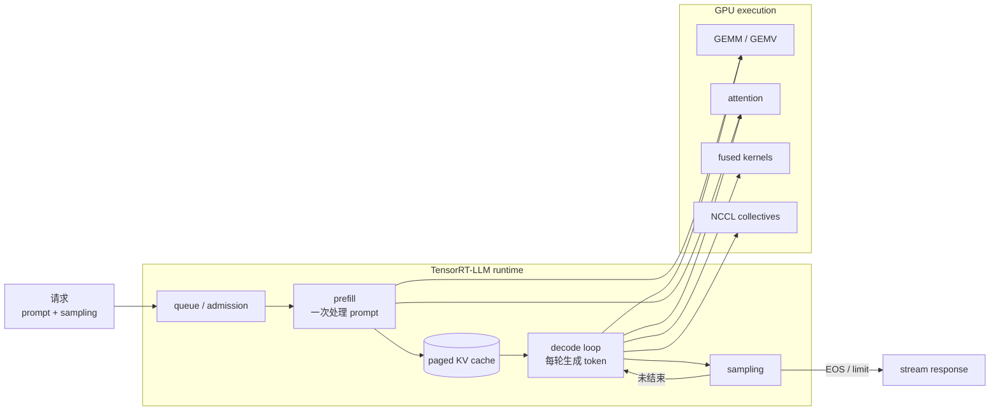
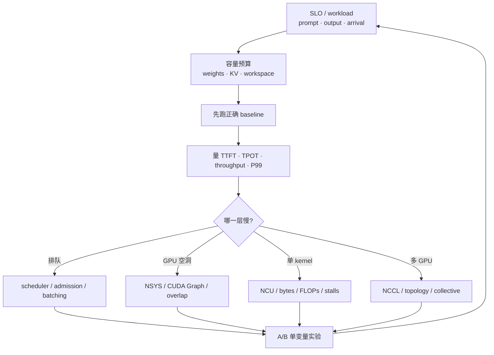

# LLM Inference 高频知识地图

这条路线不是把名词背一遍，而是把一个请求从 API 入口追到 GPU kernel，再用容量、延迟与 profiler 证据解释瓶颈。主线顺序如下：

## 先分清三个产品层次

| 层次 | 它负责什么 | 高频问题 |
|---|---|---|
| TensorRT | 把一般神经网络编译成针对目标 GPU 的 engine，并在 execution context 中执行 | builder、tactic、engine、dynamic shape、optimization profile、plugin、precision、`trtexec` |
| TensorRT-LLM | 面向 LLM 的模型/runtime/serving 组件和专用 kernel | prefill/decode、KV cache、paged attention、IFB、quantization、TP/PP/EP、speculative decoding |
| Triton Inference Server | 模型服务进程与协议、实例管理、metrics、调度整合 | backend、model repository、dynamic batching、concurrency、production serving |

三者不是同义词：TensorRT 是通用推理编译/runtime；TensorRT-LLM 处理 LLM 特有的状态与调度；Triton 是可承载不同 backend 的服务层。

## 课程覆盖矩阵

| 主题 | 能讲清楚 | 必须能算/做 |
|---|---|---|
| 请求路径 | queue → prefill → decode → sampling | 给 trace 标出 TTFT、TPOT、E2E |
| Attention | MHA/MQA/GQA、prefill/decode 差异 | 算 KV bytes/token，解释 head 数变化 |
| KV cache | block、page table、fragmentation、reuse、offload | 算容量上限；手动模拟 allocate/free |
| 调度 | static/continuous batching、chunked prefill、admission | 写一个 iteration-level scheduler |
| TensorRT | build/runtime、tactic、profile、context、plugin | 用 `trtexec` 建 engine、跑 shape matrix |
| TensorRT-LLM | LLM API/Executor、engine/runtime、serving | 跑离线与在线 benchmark、读取配置 |
| 量化 | FP16/BF16、FP8、INT8、INT4、weight-only、KV quant | 分开评估 memory、latency、quality |
| 多 GPU | TP、PP、DP、EP | 画 collective；估算通信是否进入 critical path |
| 性能 | TTFT、TPOT/ITL、throughput、goodput、P50/P99 | prompt/output/concurrency 矩阵 + NSYS/NCU |
| 高阶优化 | fusion、CUDA Graph、prefix reuse、speculative decode、P/D disaggregation | 每次只改一个变量并保留证据 |

## 阅读与实作顺序

1. [基本模型](fundamentals.md)：先会分 prefill/decode，知道 latency 指标。
2. [容量计算](calculations.md)：手算 weight、KV 与并发上限。
3. [TensorRT](tensorrt.md)：理解 build phase 与 runtime phase。
4. [TensorRT-LLM](tensorrt-llm.md)：把 LLM 特有的 cache、scheduler、kernel 接进来。
5. [Serving 与调度](serving.md)：理解 continuous batching、chunked prefill 与 SLO。
6. [量化与多 GPU](optimization.md)：知道何时省 memory、何时被 communication 反噬。
7. [Profiling](profiling.md)：从服务指标一路下钻到 kernel。
8. [面试验收](interview-checklist.md)：闭卷回答与白板计算。

## 官方资料与版本规则

TensorRT 与 TensorRT-LLM 的 CLI、默认值和 API 会改变。课程只固定稳定心智模型；运行命令前要将 container/tag、TensorRT、TensorRT-LLM、CUDA、driver、GPU 型号写进报告。

- [TensorRT：How TensorRT Works](https://docs.nvidia.com/deeplearning/tensorrt/latest/architecture/how-trt-works.html)
- [TensorRT：Dynamic Shapes](https://docs.nvidia.com/deeplearning/tensorrt/latest/inference-library/dynamic-shapes-basics.html)
- [TensorRT：Performance Optimization](https://docs.nvidia.com/deeplearning/tensorrt/latest/performance/optimization.html)
- [TensorRT-LLM：Architecture](https://nvidia.github.io/TensorRT-LLM/architecture/overview.html)
- [TensorRT-LLM：KV Cache System](https://nvidia.github.io/TensorRT-LLM/features/kvcache.html)
- [TensorRT-LLM：Paged Attention / IFB / Scheduling](https://nvidia.github.io/TensorRT-LLM/features/paged-attention-ifb-scheduler.html)
- [TensorRT-LLM：Parallelism](https://nvidia.github.io/TensorRT-LLM/features/parallel-strategy.html)
- [TensorRT-LLM：Quantization](https://nvidia.github.io/TensorRT-LLM/features/quantization.html)
