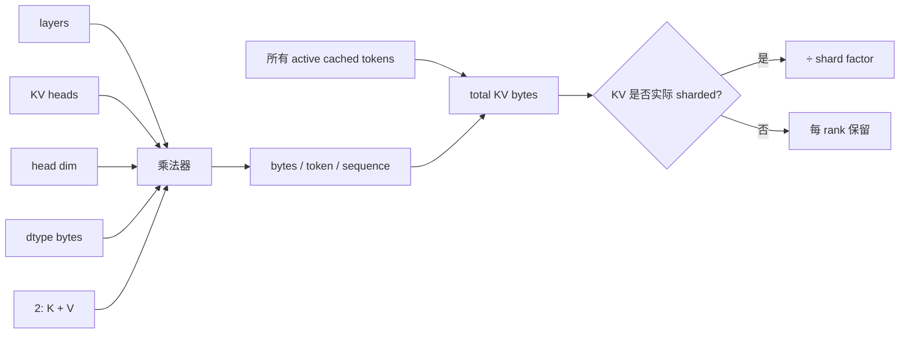
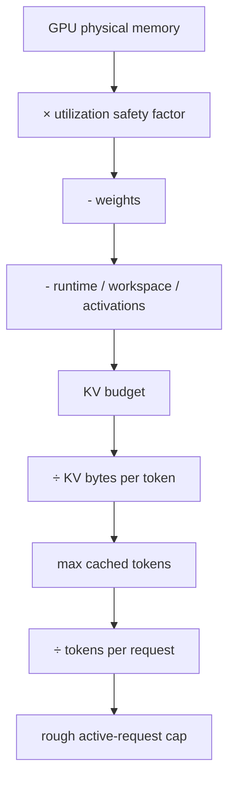
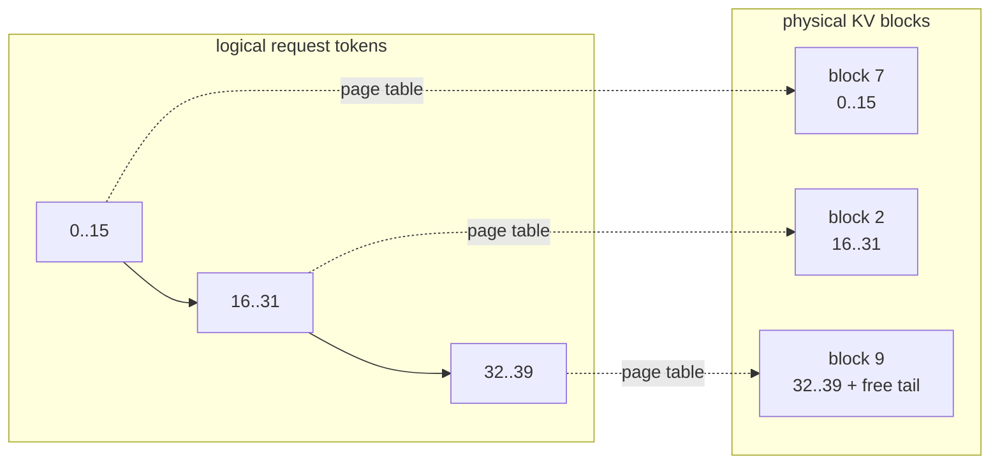

# LLM inference 白板计算

这些公式用于给量级与容量上界，不取代实际 engine/runtime 的 memory telemetry。

## 1. Weight memory

忽略 scale、zero-point、padding、embedding sharing 与 engine metadata 时：

```text
weight_bytes ≈ parameter_count × weight_bits / 8
```

例如 7B parameters：FP16 约 14 GB（十进制），INT8 约 7 GB，INT4 约 3.5 GB。实际显存还要加量化 metadata、runtime、CUDA context、activation、workspace、KV cache 与 allocator fragmentation。

## 2. KV cache

对 decoder-only Transformer：

```text
bytes_per_cached_token_per_sequence
  = 2 × num_layers × num_kv_heads × head_dim × dtype_bytes
    ↑ K + V

total_KV_bytes
  = bytes_per_cached_token_per_sequence
    × total_cached_tokens
```

如果 KV heads 确实跨 tensor-parallel ranks 均匀切分，每 rank 可再除以 shard factor；当 KV heads 少于 TP degree 或实现选择复制 KV 时不能直接除。



例：32 layers、8 KV heads、head dim 128、FP16：

```text
2 × 32 × 8 × 128 × 2 = 131072 bytes = 128 KiB / token / sequence
4096 tokens ≈ 512 MiB / sequence
8 sequences × 4096 tokens ≈ 4 GiB
```

同结构若用 32 KV heads，KV 是上例 4 倍。

## 3. 粗略并发容量

```text
usable_gpu_bytes = physical_gpu_bytes × memory_utilization

kv_budget = usable_gpu_bytes
          - weight_bytes
          - runtime_and_workspace_bytes

max_total_cached_tokens = floor(kv_budget / kv_bytes_per_token)
```

如果每个 request 最坏缓存 `S + O` tokens：

```text
max_active_requests ≈ floor(max_total_cached_tokens / (S + O))
```

这是 admission 上界，不是性能最优 batch。还需给 page/block 粒度留空间，并验证 P99 和 OOM 行为。



## 4. Paged KV cache 的内部浪费

若每 block 容纳 `P` tokens，而 request 目前有 `T` cached tokens：

```text
allocated_tokens = ceil(T / P) × P
internal_waste = allocated_tokens - T
```

page 越小，尾块浪费通常越少，但 metadata/page-table 与管理开销会增加。连续大 buffer 还会遇到 external fragmentation 与搬移问题；paged allocation 用非连续 blocks 映射逻辑序列。



## 5. 用 repo 计算器检查手算

先手算，再执行：

```bash
python3 tools/llm_calculator.py kv \
  --layers 32 --kv-heads 8 --head-dim 128 \
  --dtype-bytes 2 --sequence 4096 --batch 8

python3 tools/llm_calculator.py capacity \
  --gpu-gib 24 --memory-utilization 0.90 \
  --params-billions 7 --weight-bits 16 --overhead-gib 2 \
  --layers 32 --kv-heads 8 --head-dim 128 --dtype-bytes 2 \
  --tokens-per-request 4608

python3 tools/llm_calculator.py latency \
  --ttft-ms 120 --tpot-ms 18 --output-tokens 128
```

验收：你要能解释工具每一项输入来自 model config、runtime config 还是 workload，而不是只会贴输出。
