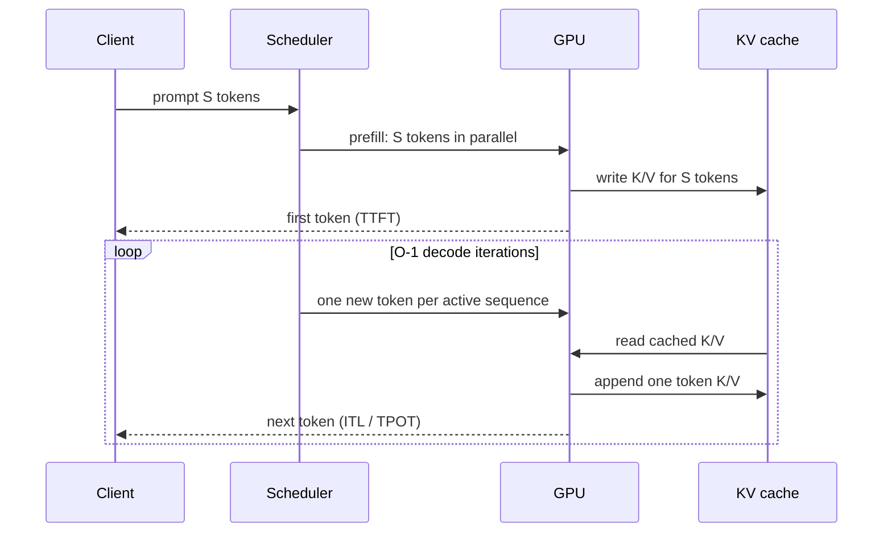
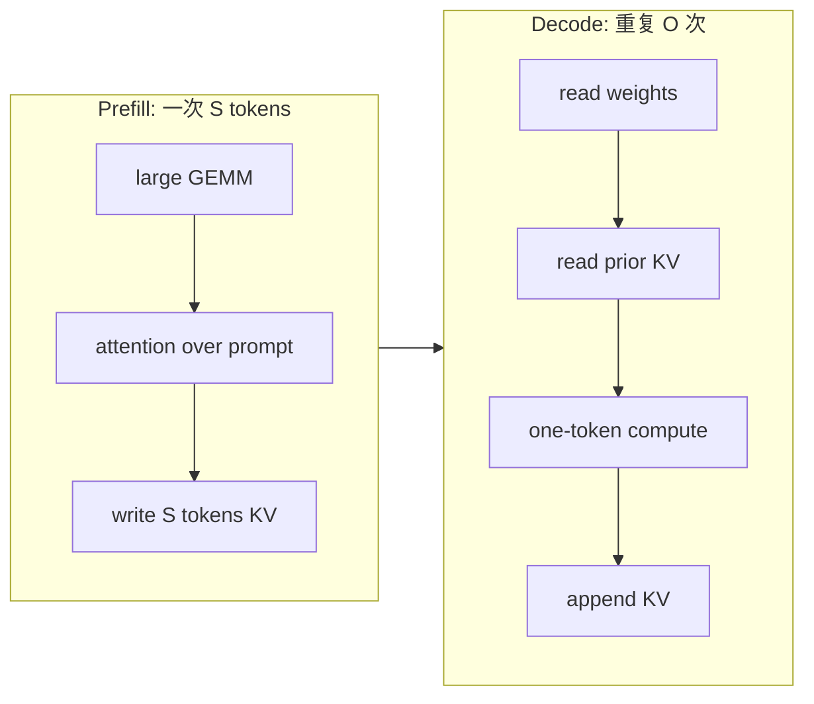
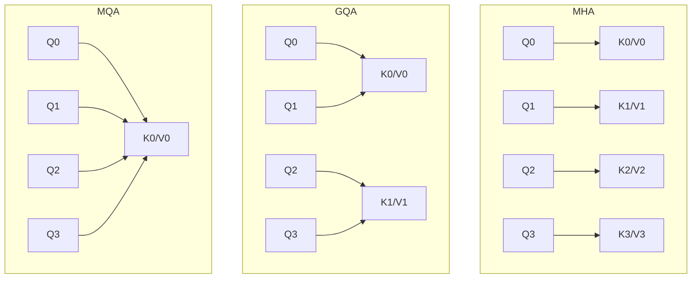

# LLM inference 基本模型

## 一次请求到底做了什么

设 prompt 有 `S` tokens、生成 `O` tokens。decoder-only Transformer 通常分两种形态：



### Prefill

- 对整段 prompt 做 forward，token 维度有较高平行度。
- attention 的 QK 与 softmax/V 工作随 context 增长很快；同时大 GEMM 更容易把 GPU 算力吃满。
- 直接影响 TTFT，也会与正在 decode 的请求争用 GPU。

### Decode

- 每个 active sequence 每轮通常只产生一个 token。
- 会读取模型权重，并读取到目前为止的 KV；单 request 容易是 memory-bandwidth 或 launch-latency 敏感。
- batching 会让同一份权重服务更多 sequences，提高 arithmetic intensity，但会引入排队与尾延迟权衡。



面试中不要只说“prefill compute-bound、decode memory-bound”就结束。这是常见趋势，不是定律；小模型、大 batch、长 context、量化、GPU 架构、kernel 实现都会改变瓶颈，最后必须靠测量确认。

## MHA、GQA、MQA 为什么影响 serving

设 query heads 为 `Hq`、KV heads 为 `Hkv`、每头维度 `Dh`：

- MHA：通常 `Hkv = Hq`，表达能力与 KV 容量最大。
- GQA：多个 query heads 共用一组 K/V，`1 < Hkv < Hq`。
- MQA：全部 query heads 共用单组 K/V，`Hkv = 1`。



KV cache 大小与 `Hkv` 成正比，所以从 32 个 KV heads 变成 8 个，在其他条件相同下约省 4 倍 KV；这不代表整个服务显存省 4 倍，因为 weights、workspace 与 activation 不随它同倍率变化。

## 高频性能指标

| 指标 | 定义 | 它主要暴露什么 |
|---|---|---|
| TTFT | 请求进入到收到第一个 token | queue、admission、prefill、首轮 decode |
| TPOT / ITL | 首 token 后，相邻输出 token 的平均间隔 | decode loop 与 scheduler |
| E2E latency | 请求进入到最后一个 token | TTFT + decode duration |
| output tok/s | 单位时间完成的输出 tokens | 系统吞吐，但不能代替 latency |
| request/s | 单位时间完成的请求 | 受 output length 分布影响很大 |
| goodput | 满足指定 SLO 的有效请求/token throughput | latency 与 throughput 的共同目标 |
| P50/P95/P99 | 延迟分位数 | steady state 与尾延迟 |

对单请求、稳定 TPOT 的近似：

```text
E2E_ms ≈ TTFT_ms + max(O - 1, 0) × TPOT_ms
```

第一个 token 已经包含在 TTFT，所以是 `O-1` 个间隔。真实系统需保留逐 token timestamp，因为 TPOT 往往不恒定。

## 正确 benchmark 的 workload 四元组

任何吞吐数字都必须附上：

```text
(prompt length distribution,
 output length distribution,
 arrival pattern / concurrency,
 latency SLO)
```

只报“模型有 1000 tok/s”无法比较；让 output 很短、无限加 queue、忽略 P99，都可以把吞吐数字美化。
