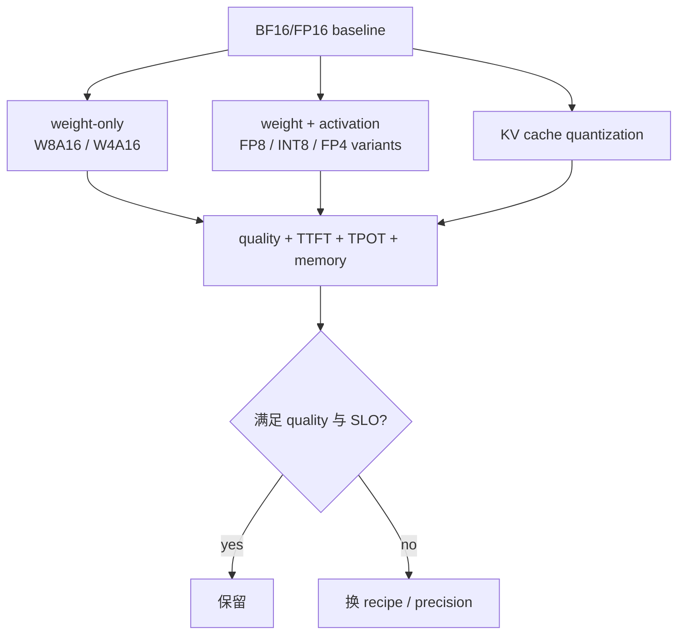
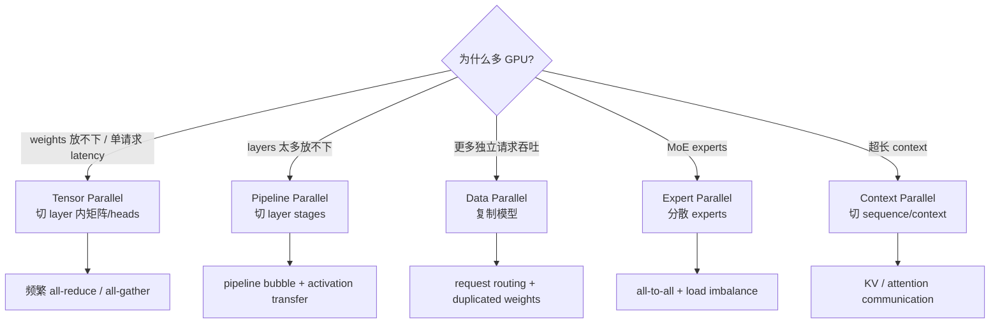

# 量化、多 GPU 与高阶优化

## 量化先问“量化谁”

`W4A16` 表示 4-bit weights、16-bit activations；它和 KV cache dtype 是不同旋钮。

| 对象 | 降低精度的主要收益 | 主要风险/代价 |
|---|---|---|
| weights | 模型更容易 fit、少读 weight bytes、可能用更快 Tensor Core | scale/packing/dequant、accuracy、kernel/hardware 支持 |
| activations | 减少 activation traffic 并启用低精度 compute | dynamic range、校准、累加精度 |
| KV cache | 提高长 context/并发容量、少读 KV bytes | attention accuracy、quant/dequant、支持组合限制 |
| logits/sampling | 通常不是首选容量收益点 | 排序/概率对数值敏感 |

量化验收必须同时包含：代表性 task quality/perplexity、model memory、KV capacity、TTFT/TPOT、吞吐、P99。位数下降不保证 latency 同比例下降；可能受 kernel coverage、batch/shape、dequant 或其他瓶颈限制。

## TP、PP、DP、EP、CP

| 策略 | 切什么 | 通信/低效来源 | 适合 |
|---|---|---|---|
| TP | layer 内 weights、heads | 每层 collective，依赖 NVLink/拓扑 | 降单 rank weight、低 batch latency |
| PP | layers | stage 边界 activation、pipeline bubbles | 深模型 fit、多 batch/microbatch |
| DP | requests | 模型复制；入口负载均衡 | 单卡可 fit、追求 aggregate throughput |
| EP | experts | token all-to-all、hot expert imbalance | MoE |
| CP | context | attention/KV 交换 | 极长 context |

TP 不等于显存一律除以 TP degree：runtime/context 有复制部分；GQA/MQA 的 KV heads 少于 TP degree 时，KV cache 也可能在 ranks 上复制。必须从实际 mapping 与 memory telemetry 确认。

## 组合选择

先满足 fit，再优化 SLO：

1. 估 weights + KV + runtime memory；决定单卡是否可能。
2. 不 fit 时比较 weight quantization、KV quantization、TP/PP。
3. fit 以后，在目标 concurrency 下测 TTFT/TPOT；不要从理论 TOPS 选并行度。
4. 用 NSYS 看 NCCL 是否进入 critical path、GPU 间是否负载不均。
5. 扫 `TP × PP × batch/token budget`，每组记录 topology。

## 高频优化的适用条件

| 技术 | 它减少什么 | 何时可能没用/变慢 |
|---|---|---|
| fused kernel | launch 与 intermediate memory traffic | register pressure、shape 不支持 |
| CUDA Graph | CPU launch overhead | dynamic shape 覆盖差、graph padding/管理成本 |
| paged KV | fragmentation、动态容量管理 | block metadata、tail waste、复杂管理 |
| prefix reuse | 重复 prefill | prefix 不共享、eviction、隔离要求 |
| chunked prefill | decode 干扰与 queue blocking | chunks 太小导致效率差 |
| speculative decoding | 串行 target steps | acceptance 低、draft 贵、大 batch |
| P/D disaggregation | prefill/decode 资源干扰 | KV transfer 与系统复杂度 |

官方资料：[TensorRT-LLM Parallelism](https://nvidia.github.io/TensorRT-LLM/features/parallel-strategy.html)、[Quantization](https://nvidia.github.io/TensorRT-LLM/features/quantization.html)。
