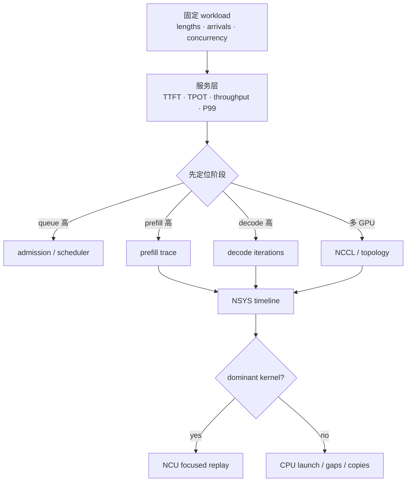
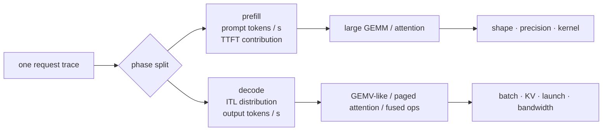

# LLM inference profiling：从 SLO 下钻到 kernel

## 不要一开始就开 NCU



NCU 会 replay kernel，并可能严重扰动在线调度；先从可控离线/缩小 workload 选定 kernel，再采少量 metric set。

## 需要采集的四层证据

### 1. Workload 与服务指标

- prompt/output length distribution，不只平均数。
- arrival pattern：closed-loop concurrency 或 open-loop request rate。
- TTFT、TPOT/ITL、E2E 的 P50/P95/P99。
- request/s、input/output/total tok/s、goodput、错误/OOM。
- warmup、run duration、seed、stop criteria 与 tokenizer。

### 2. Runtime 与 memory

- active/queued requests、scheduled tokens/iteration。
- KV used/free blocks、reuse hit/miss、eviction/offload/preemption。
- CUDA Graph hit/fallback、batch/shape histogram。
- GPU memory：weights、KV、workspace/activation、headroom。

### 3. NSYS timeline

- CPU scheduler/sample/stop logic 是否留下 GPU gaps。
- prefill 是否让 decode stream 长时间等待。
- H2D/D2H、KV transfer 是否与 compute overlap。
- NCCL collective 位于 critical path 还是被 overlap。
- kernel launch 是否碎片化；CUDA Graph 前后是否减少 gaps。

### 4. NCU kernel

- achieved bandwidth / compute throughput 与理论 ceiling 的关系。
- arithmetic intensity、memory sectors、coalescing、cache hit。
- warp issue/stall、occupancy、register、shared memory、spill。
- Tensor Core 指令/pipe 是否实际使用。

## Prefill 与 decode 要分开报告



同一个“平均 GPU utilization”会把两种工作形态混在一起，不能直接指导优化。

## 最小 benchmark matrix

| 维度 | 至少三个点 |
|---|---|
| prompt length | short / typical / long |
| output length | short / typical / long |
| concurrency 或 request rate | latency point / knee / overload |
| precision | baseline / candidate |
| cache state | cold / warm shared prefix |

先找 throughput-latency knee：增加 load 时 throughput 开始饱和、queue/P99 快速上升的位置。生产容量要留在 knee 前并保留故障/流量 headroom。

## 实验报告模板

```text
Hypothesis:
  decode 被 weight/KV bandwidth 限制；增加 continuous batch 会降低 TPOT 成本。

Controlled variables:
  model/revision, GPU/clock, software versions, prompt/output trace, precision

Changed variable:
  max token budget: 2048 -> 4096

Evidence:
  TTFT P50/P99, TPOT P50/P99, output tok/s, queue depth,
  KV blocks, graph hit, NSYS gaps/NCCL, selected NCU metrics

Conclusion:
  哪个 SLO 获益/受损；结论只适用于什么 workload；下一次单变量实验
```

官方资料：[TensorRT-LLM Benchmarking](https://nvidia.github.io/TensorRT-LLM/developer-guide/perf-benchmarking.html)、[TensorRT Performance Benchmarking](https://docs.nvidia.com/deeplearning/tensorrt/latest/performance/benchmarking.html)。
