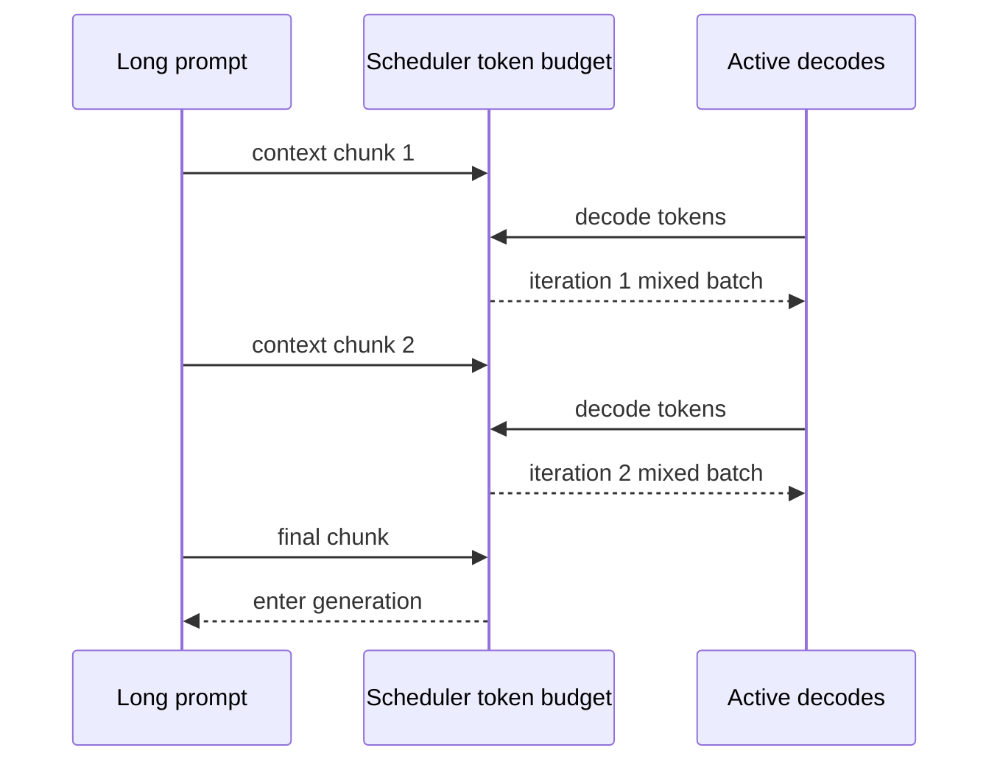
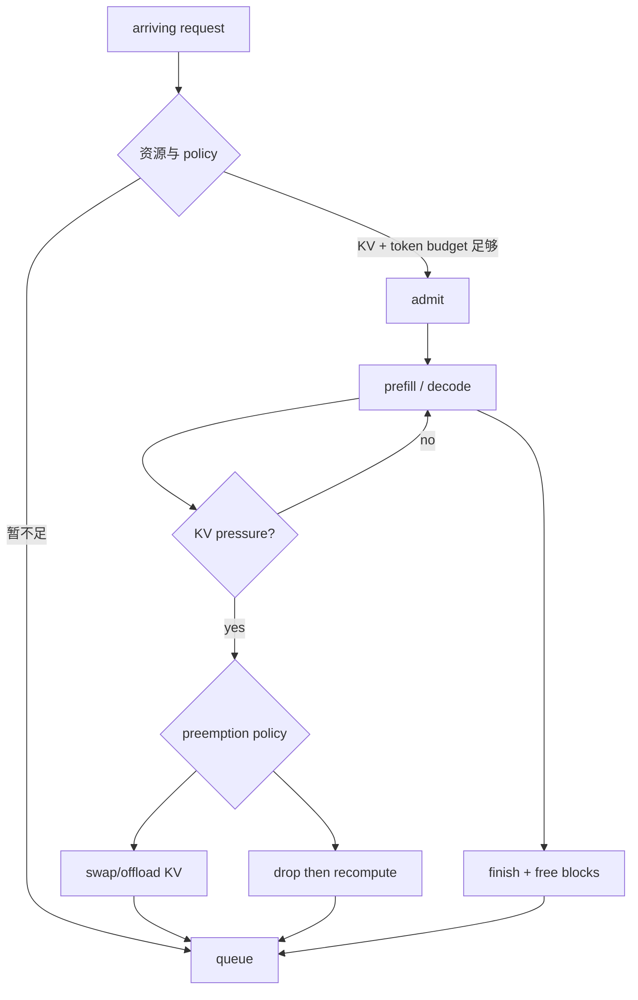
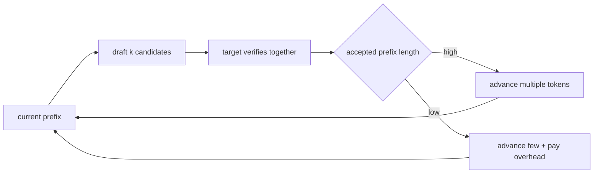

# Serving、batching 与 scheduler

## Static batching vs continuous batching

Static batching 要等一批请求全部结束才能重填；输出长度不同会产生空槽。Continuous/in-flight batching 在 iteration 边界移除完成序列并加入等待请求。

```mermaid
gantt
  title Static batching：短请求结束后槽位空着
  dateFormat X
  axisFormat %s
  section slot 0
  A (4 tokens) :0, 4
  idle         :4, 8
  section slot 1
  B (8 tokens) :0, 8
  section slot 2
  C waits      :8, 12
```

```mermaid
gantt
  title Continuous batching：iteration 边界立即补位
  dateFormat X
  axisFormat %s
  section slot 0
  A (4 tokens) :0, 4
  C admitted   :4, 8
  section slot 1
  B (8 tokens) :0, 8
```

它提高 GPU 利用率，但 scheduler 每轮改变 batch shape/state；因此 CUDA Graph 命中、packed layout、KV block 管理与 CPU scheduling overhead 都变重要。

## Chunked prefill 为什么存在

长 prompt 的 prefill 若一次吃完 token budget，会延迟正在 decode 的请求，也可能让短请求长时间排队。Chunked prefill 把 context 拆成数个 chunks，与 decode work 交错。

chunk 太大，decode ITL 容易被 prefill 干扰；chunk 太小，会增加调度/launch 次数并降低 prefill kernel 效率。要在实际 prompt distribution 与 SLO 下扫参数。

## Admission、preemption 与 fairness

高频 trade-off：

- throughput policy 可能偏好让 GPU 保持大 batch，却伤害 queue/P99。
- FIFO 易理解，但长 prompt 会 head-of-line blocking。
- 优先级能保护 interactive traffic，也可能饿死 background requests。
- recompute 少占 host transfer，但浪费 GPU compute；swap 保存 compute，却吃 PCIe/NVLink 与 host memory。

## Prefix reuse 与 speculative decoding

Prefix reuse 命中时跳过重复前缀的部分 prefill；适合固定 system prompt、模板或共享文档前缀。要报告 hit rate、reused tokens、lookup/eviction、tenant isolation，而不是只报告“打开 cache”。

Speculative decoding 用较轻的 draft 机制提出多个 token，由 target model 一次验证；低 batch、较高 acceptance 时能减少串行 target forward 次数。它不是无条件加速：draft cost、verification、低 acceptance、大 batch 都会抵消收益。

## Prefill/decode disaggregation

Prefill 与 decode 的计算形态和 SLO 不同，可放到不同 worker pools；prefill worker 算出 KV，再传给 decode worker。优点是独立扩缩与隔离干扰，代价是 KV transfer、routing、故障恢复与更复杂的 capacity planning。只有 KV 传输能被收益覆盖时才成立。

## 必做 scheduler lab

完成 `labs/llm-inference/scheduler_lab.py`：

- 输入不同 output lengths 与 `max_batch_size`。
- 实现 static 与 continuous 两种 decode scheduler。
- 输出每个 iteration 的 slot/request 对应、完成时间、空槽数。
- 用 `[2, 8, 3, 6, 1]`、batch=2 证明两种策略的差异。

之后加 arrival time 与 prefill chunks；设计一个让吞吐上升但 P99 变差的 workload，并解释原因。

官方资料：[Paged Attention / IFB / Request Scheduling](https://nvidia.github.io/TensorRT-LLM/features/paged-attention-ifb-scheduler.html)、[Speculative Decoding](https://nvidia.github.io/TensorRT-LLM/features/speculative-decoding.html)。
