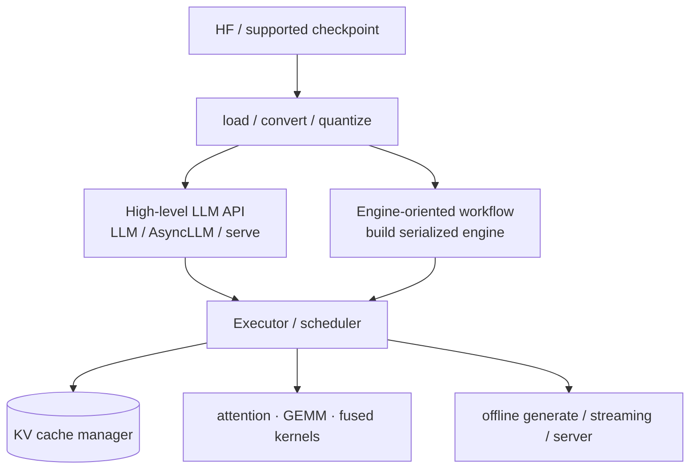
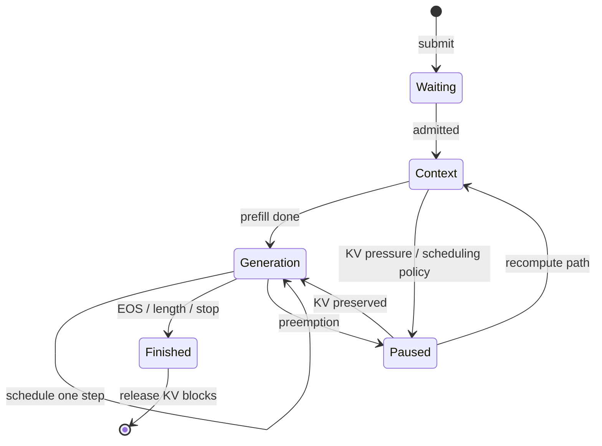
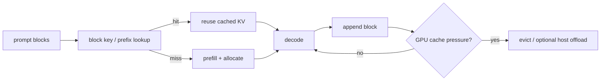

# TensorRT-LLM：模型、runtime 与服务

TensorRT-LLM 不只是“TensorRT 跑一个 Transformer”。它还必须长期管理每个 request 的 KV 状态、每轮重新组 batch、执行 sampling，并在多 GPU 间协调。

## 两种工作流心智模型

API 与 backend 会随版本演进，面试和读旧 repo 时会同时看到两类路径：

不要背某个 release 的唯一 CLI。先 pin container/tag，再看该版本的 example 与 `--help`。稳定的检查点是：model config 是否匹配、tokenizer 是否一致、最大 sequence/token budget、quantization artifact、parallel mapping、KV config 与 benchmark workload。

## Request 生命周期

每个 iteration，scheduler 在 `max_batch_size`、token budget、KV blocks、request priority 与 policy 下选一组工作；executor 组织 packed tensors，跑 GPU，再把 logits/sampling/stop state 回传。

## KV cache manager

官方实现以 token blocks 管理 KV，并支持跨请求 prefix reuse、有限 attention window、MQA/GQA、可选 host offload 与 eviction policy。重要关系：

必须知道的限制：reuse 只在 token、model/adapters 与 cache identity 等条件正确时成立；多租户要考虑 cache salting/隔离；offload 命中仍有 host↔GPU copy latency；更高 reuse rate 不自动等于更低 P99。

## 高频配置要按类别理解

| 类别 | 典型设置 | 主要影响 |
|---|---|---|
| request 上限 | max batch、max sequence | admission 与最坏容量 |
| iteration token budget | max num tokens、chunked prefill | prefill/decode 混合、TTFT、KV 可用空间 |
| KV | dtype、memory fraction/max tokens、block reuse、host cache | 并发、context 长度、质量、copy |
| scheduler | policy、chunking、overlap | throughput、fairness、tail latency |
| parallel | TP/PP/DP/EP/CP mapping | fit、通信、负载平衡 |
| execution | CUDA Graph、plugin/kernel choice | launch overhead、shape coverage |

## 完整实验路径

1. 单 request 离线 generate：先验证 tokenizer、stop、输出正确与显存。
2. 固定 input/output lengths，测 batch 1 的 TTFT/TPOT；保留 warmup。
3. 打开并发和 continuous batching，测 P50/P99 与 output tok/s。
4. 改 KV dtype/quantization、token budget 或 parallel mapping，一次一项。
5. 用 NSYS 查看 scheduler/CPU launch/GPU/NCCL timeline，再对单个 dominant kernel 用 NCU。
6. 用真实或可复现的 request length/arrival trace 做最终在线 benchmark。

官方资料：[Architecture Overview](https://nvidia.github.io/TensorRT-LLM/architecture/overview.html)、[KV Cache System](https://nvidia.github.io/TensorRT-LLM/features/kvcache.html)、[Benchmarking](https://nvidia.github.io/TensorRT-LLM/developer-guide/perf-benchmarking.html)。
