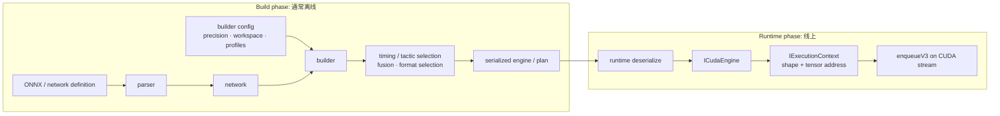
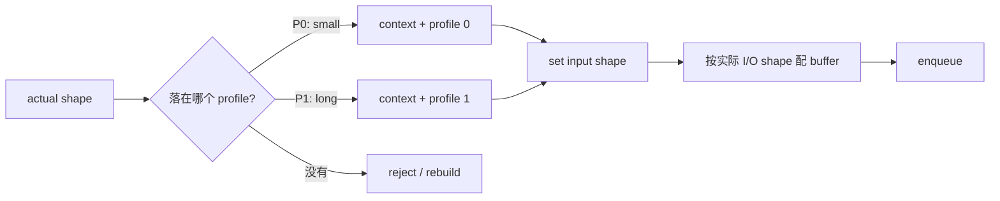
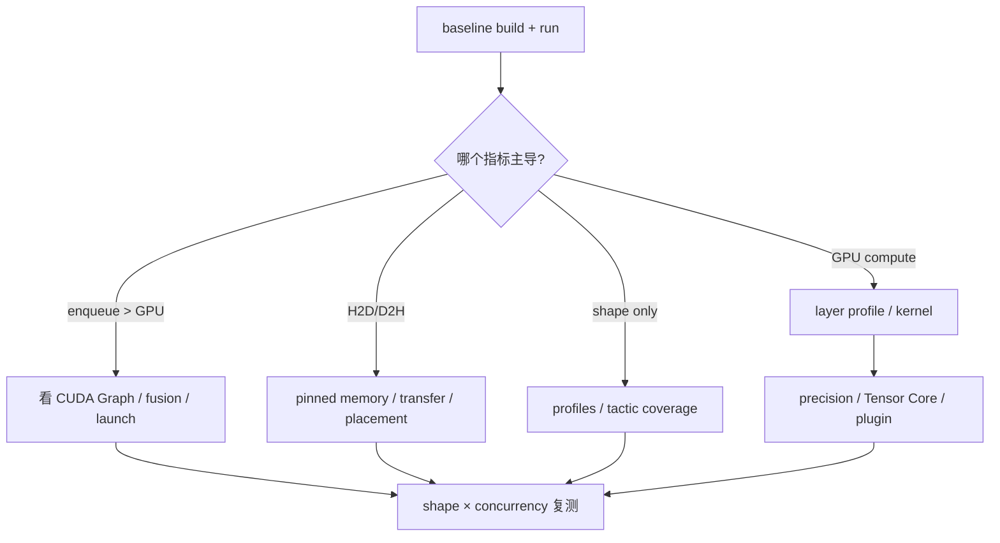

# TensorRT：从网络到 engine

## 最重要的两阶段



- Builder 会针对目标 GPU、shape/profile、precision 与 workspace 限制选择实现；build 慢不等于 inference 慢。
- Engine 是编译产物，不应默认跨 GPU 架构、TensorRT 版本或 plugin 环境可移植。它也应像 native binary 一样只从可信来源加载。
- 一个 engine 可创建多个 execution contexts；context 保存执行状态与 runtime shape。并发时要管理各自的 context、profile、stream 与 device memory。

## Dynamic shape 与 optimization profile

模型输入含 `-1` 只说明维度是 runtime 决定；builder 仍需一个或多个 profile：

```text
MIN <= runtime shape <= MAX
OPT = builder 重点调优的代表 shape
```



高频坑：

- `MAX` 设得极大可能增加 memory、build time，并禁用只适用于固定 shape 的 tactics。
- 只测 `OPT` shape 会掩盖 profile 边缘的慢路径或 OOM。
- 切 profile 与设 shape 要和真正执行的 stream/context 顺序一致。
- output 可能是 data-dependent shape，不能只按静态网络维度分配。

## Tactic、fusion、precision 与 plugin

| 项目 | 要回答的问题 |
|---|---|
| tactic | 同一 layer 候选 kernel 哪个在目标条件最快？workspace 上限是否筛掉候选？ |
| timing cache | 如何避免每次 build 重复 timing？cache 是否与目标环境匹配？ |
| fusion | 是否减少 launch 与中间 global traffic？是否改变可观测 layer 名称？ |
| precision | FP16/BF16/FP8/INT8 是否真的走目标 kernel？插入 reformat/cast 的代价多少？ |
| Tensor Core | shape、alignment、data type 是否满足高效路径？ |
| plugin | 原生不支持或需自定义 fused op 时怎么扩展？serialization/version/format 是否正确？ |

## `trtexec` 实验，不背固定命令

CLI flags 随版本迁移，先执行 `trtexec --help`。实验流程固定：

1. 用明确的 model、precision、MIN/OPT/MAX shapes 产生 engine。
2. 保存完整 build log、engine inspector/layer info 与版本。
3. 分开测 GPU compute time、enqueue time、H2D/D2H 与 end-to-end。
4. 跑 shape matrix：small/opt/large + odd shape。
5. 再分别打开 CUDA Graph、改变 workspace、precision 或 stream；一次只改一个变量。



## 必做验收

- 白板画出 Logger、Builder、Network、Config、Engine、Runtime、ExecutionContext 的生命期。
- 解释为什么 engine build 使用大量 workspace，不代表 runtime 每个 request 都占同样 workspace。
- 给两个 execution contexts 设计 stream/profile/buffer ownership，说明哪里不能共享。
- 导入一个小 ONNX model；建立两组 profiles；用 `trtexec` 比 OPT 与 MAX 的 latency 和 layer profile。

官方资料：[How TensorRT Works](https://docs.nvidia.com/deeplearning/tensorrt/latest/architecture/how-trt-works.html)、[Dynamic Shapes](https://docs.nvidia.com/deeplearning/tensorrt/latest/inference-library/dynamic-shapes-basics.html)、[Performance Optimization](https://docs.nvidia.com/deeplearning/tensorrt/latest/performance/optimization.html)。
