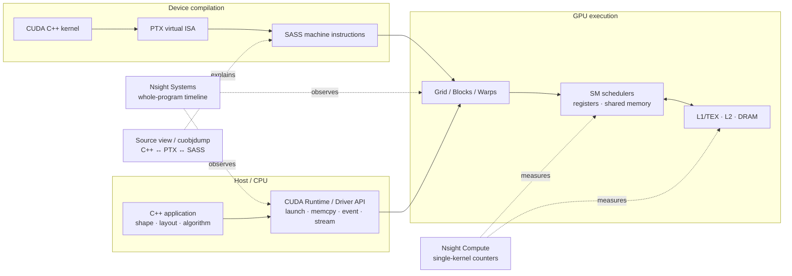
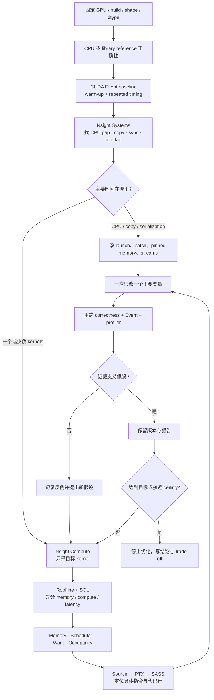

# CUDA Profiling 全链路

这里的目标不是记住一批 metric，而是学会从系统现象一路追到 C++/CUDA source、PTX、SASS 和硬件原因，再回到可验证的修改。

## 一张图看完整层次



工具的责任边界：

| 层次 | 先问什么 | 工具 |
|---|---|---|
| Application | 时间花在 CPU、copy、launch，还是 kernel？有并发吗？ | Nsight Systems |
| Kernel | 单个 kernel 是 memory、compute、latency 还是 instruction bound？ | Nsight Compute |
| Source | 哪一行造成 load、barrier、stall、spill 或多余 instruction？ | NCU Source page |
| ISA | 编译器实际产生了什么？有 vector load、FMA、local spill 吗？ | PTX/SASS、`cuobjdump` |
| Model | 这个 workload 理论上可能跑多快？优化方向是否合理？ | Roofline、occupancy calculator |

## 固定工作流



## 先跑这四条命令

```bash
# 1. 程序内 correctness + CUDA Event
./build/release/reduce_sum --version v3

# 2. 整体时间线
./scripts/profile_nsys.sh streams

# 3. 单 kernel；最后一个参数是 kernel-name regex
./scripts/profile_ncu.sh reduce_sum v3 reduce_v3

# 4. C++ 下面的 PTX / SASS / resource usage
./scripts/dump_code.sh reduce_sum
```

`--version` 可用于 `vector_add`、`reduce_sum`、`transpose`、`gemm`、`avg_pool`、`fusion`，避免一次 profile 整条版本阶梯。

## 文档阅读顺序

1. [Nsight Systems：系统时间线](profiling/nsys.md)
2. [Nsight Compute：单 kernel](profiling/ncu.md)
3. [Roofline：公式、图与计算器](profiling/roofline.md)
4. [Occupancy：资源限制与 Calculator](profiling/occupancy.md)
5. [CUDA C++ → PTX → SASS](profiling/source-to-sass.md)
6. [本 repo 算子案例](profiling/case-studies.md)
7. [实验报告模板](../progress/profile-template.md)

## 最重要的防误判规则

- NCU 与 NSYS 解决的问题不同；不要拿 NCU 解释 CPU launch gap。
- “memory-bound” 不等于“DRAM throughput 必然很高”。低 occupancy、uncoalesced access、dependency 也可能让 DRAM 喂不满。
- “compute-bound” 不等于 ALU 已经有效工作；instruction mix、dependency、Tensor Core eligibility 仍可能留下巨大差距。
- theoretical occupancy 是资源上限，achieved occupancy 是运行结果，两者都不是最终性能目标。
- warp stall reason 只有在 scheduler 没有 eligible warp / 无法 issue 时才值得优先追。
- `--set full` 会 replay kernel 多次；它不是原始应用时间线，也不应用来报告端到端 latency。
- 先用 section 名称和 UI 语义；底层 metric 名会随 GPU 与 Nsight 版本变化。
