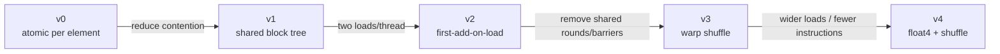
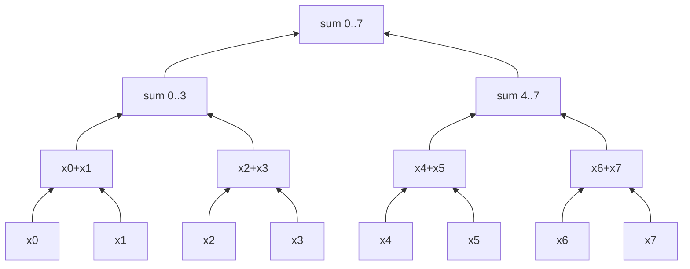
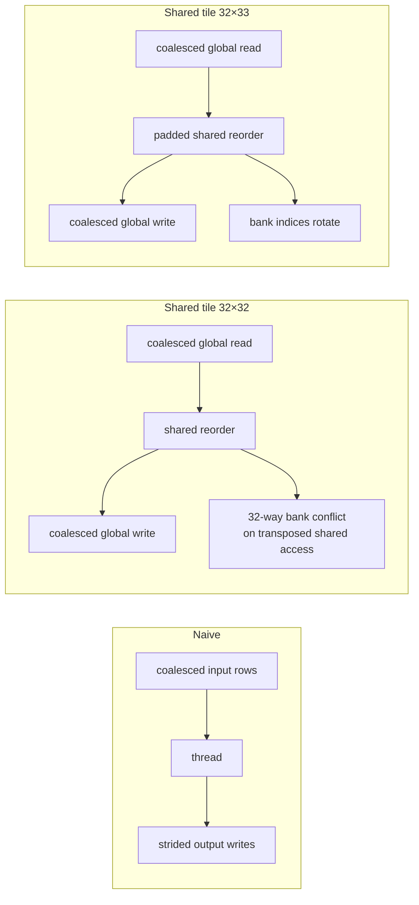
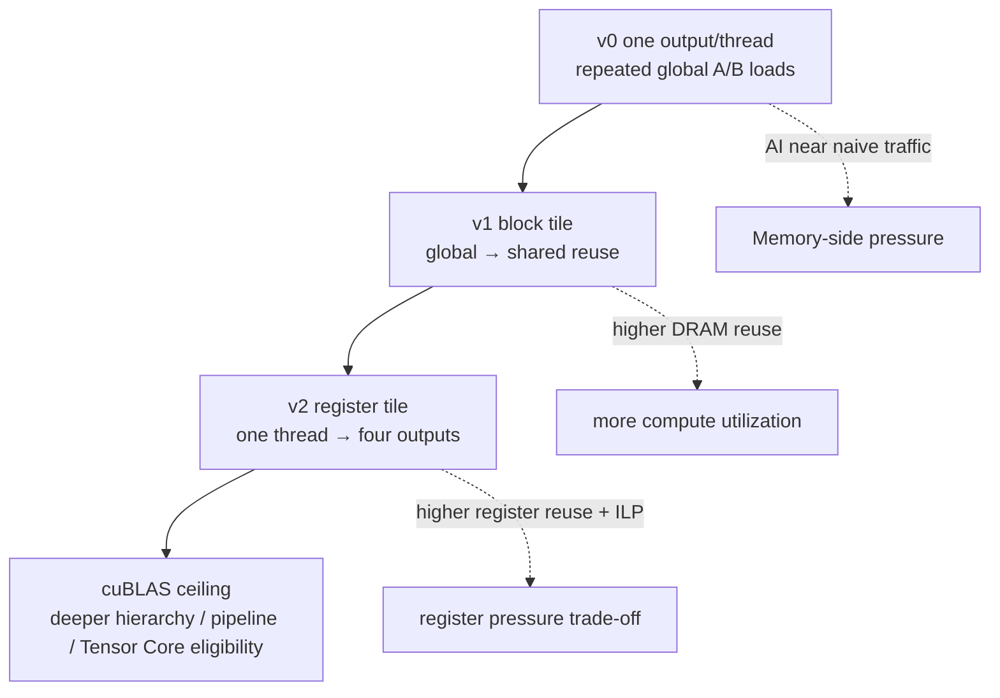
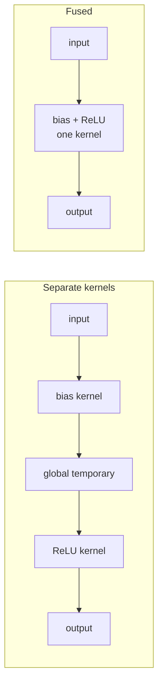
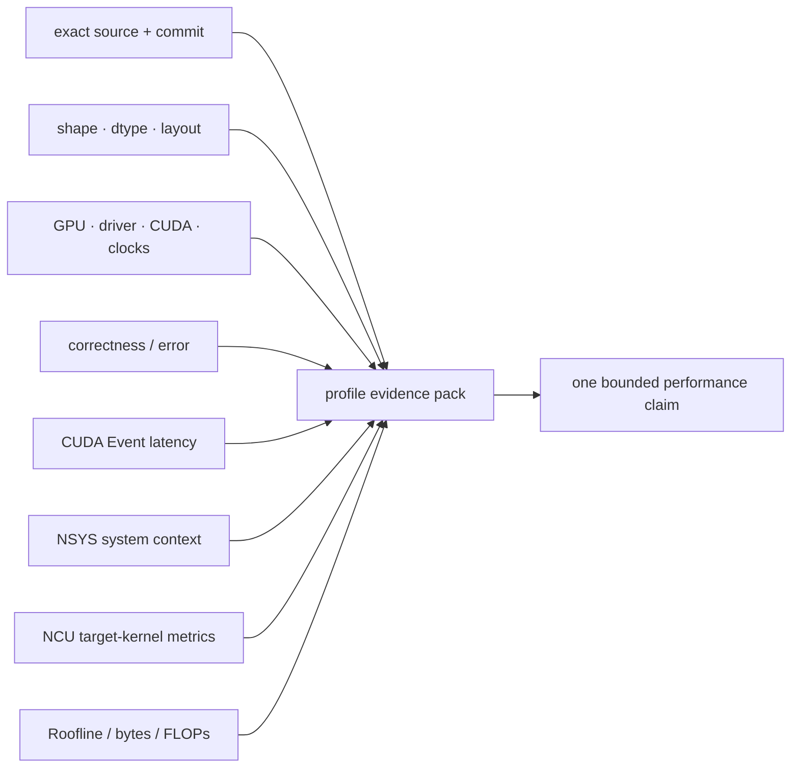

# 本 repo 的 profiling 案例地图

这里不预先写死 speedup。表中的内容是 profiler 前的假设；真正结论必须用你的 GPU、相同 build/shape 的报告验证。

## Reduction v0 → v4



8 个值的 reduction tree：



| 版本 | 首要假设 | NCU 重点 |
|---|---|---|
| v0 | 单一 output atomic 严重 serialization | atomic instructions、duration、eligible warps、memory throughput 未必高 |
| v1 | atomic 次数降为 blocks，shared/barriers 成新成本 | barriers、shared transactions、warp stalls |
| v2 | block/rounds 减少，load 保持 coalesced | duration、global load sectors、barrier count |
| v3 | warp shuffle 让最后阶段留在 registers | shuffle instructions、shared/barrier 减少、registers |
| v4 | load instruction 数可减少，但 AI 不变 | SASS load width、requests、DRAM ceiling、alignment |

```bash
./scripts/profile_ncu.sh reduce_sum v0 reduce_v0
./scripts/profile_ncu.sh reduce_sum v3 reduce_v3
```

## Transpose v0 → v2



| 比较 | 预期证据 |
|---|---|
| v0 → v1 | global sectors/request 与 effective bandwidth 改善；新增 barrier/shared traffic |
| v1 → v2 | global traffic 基本相同；shared bank conflict 与 duration 下降 |

```bash
./scripts/profile_ncu.sh transpose v0 transpose_v0
./scripts/profile_ncu.sh transpose v1 transpose_tiled
./scripts/profile_ncu.sh transpose v2 transpose_tiled
```

## GEMM v0 → v2 → cuBLAS



依次记录：

1. FLOPs 固定为 `2MNK`；
2. NCU Roofline achieved point 是否向右/上移动；
3. DRAM bytes 是否因 tiling 降低；
4. registers/thread 与 occupancy 如何变化；
5. eligible warps、FMA pipeline、instruction mix 是否改善；
6. 自写版达到 cuBLAS latency/GFLOP/s 的百分比，但不把 library 内部 kernel 当自己的实现。

```bash
./scripts/profile_ncu.sh gemm v0 gemm_v0
./scripts/profile_ncu.sh gemm v1 gemm_v1
./scripts/profile_ncu.sh gemm v2 gemm_v2
./scripts/profile_ncu.sh gemm v3
```

## Average Pool：reuse 是否值得 shared memory

```mermaid
flowchart TD
  SHAPE[K / stride / output tile] --> INPUT[input tile =<br/>(OUT-1)×stride + K]
  INPUT --> OVERLAP{相邻 windows 重叠多吗?}
  OVERLAP -->|K3 / S1| HIGH[高 reuse<br/>shared tile 可能减少 DRAM reads]
  OVERLAP -->|K2 / S2| LOW[几乎无 reuse<br/>shared copy + barrier 可能亏]
  LOW --> SPEC[专用 float4 / two outputs per thread]
  HIGH --> GEN[通用 cooperative-load kernel]
```

分别 profile 两个 workload：

- `K=3,S=1`：对比 v0/v1，重点看 DRAM traffic 与 barrier trade-off；
- `K=2,S=2`：对比 v0/v1/v2，确认 specialization 是否减少 instruction，而不是假设 shared 一定快。

## Fusion：端到端 traffic 才是目标



先用 NSYS 看到 kernel 数与 launch gap，再用 NCU 看 fused kernel 的 memory traffic/registers。只看 fused kernel 自己的 duration 会漏掉 separate 版本的 intermediate traffic 和第二次 launch。

## Streams：必须回到 NSYS

`src/07_streams.cu` 的目标不是让单 kernel 更快，而是让 H2D、compute、D2H 的 wall time 重叠。NCU 无法证明跨 streams overlap；用 NSYS timeline 计算：

```text
overlap ratio ≈ 1 - wall_time / (sum of isolated copy + kernel durations)
```

这个近似只用于同一稳定区间。最终仍报告实际 wall time、chunks、streams、pinned memory 与 timeline 证据。

## 每个案例的最小证据包


