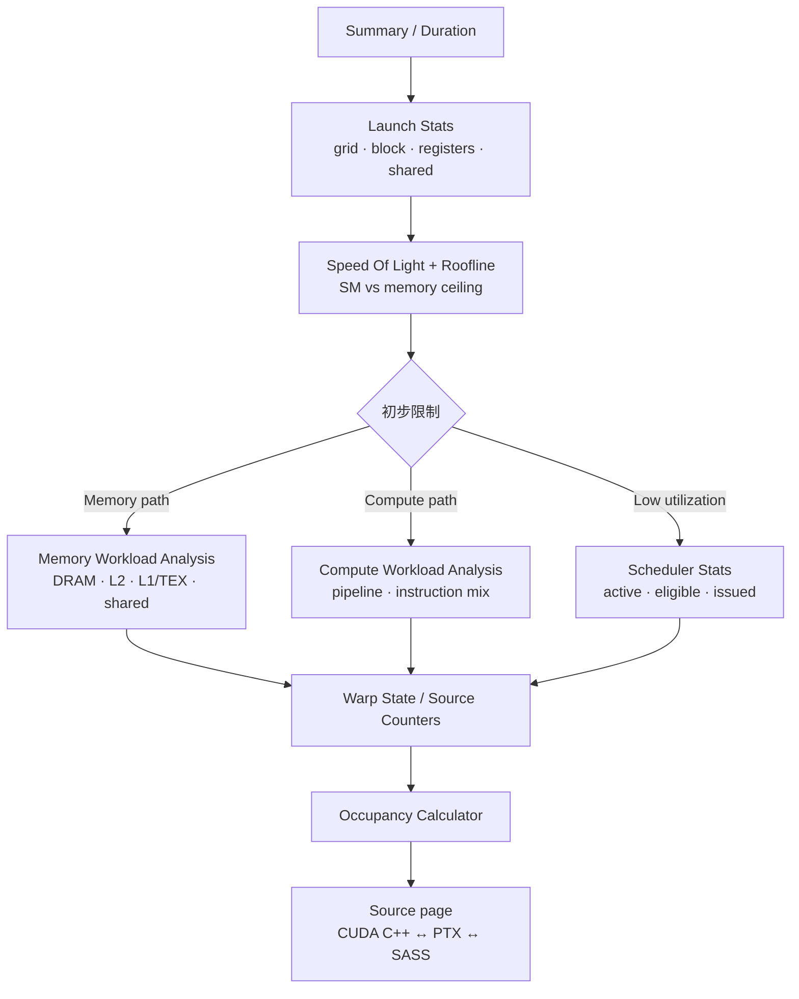
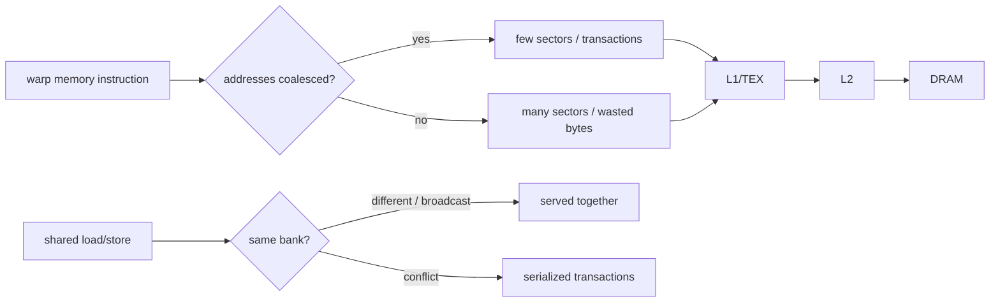
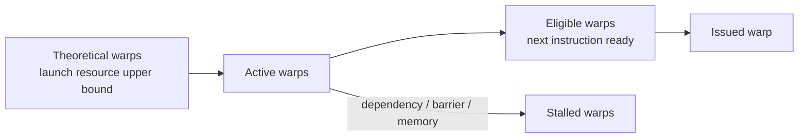
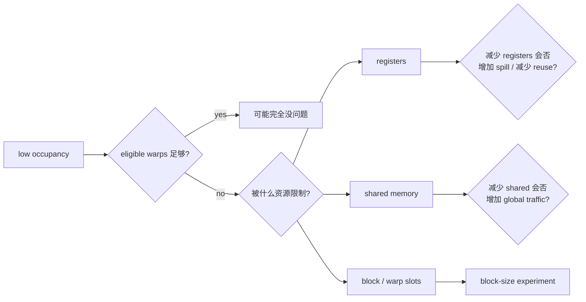

# Nsight Compute：把一个 kernel 拆开看

Nsight Compute（NCU）回答的是 “这个 kernel 在 SM 与 memory hierarchy 里为什么得到这样的速度”。先在 NSYS 找到目标，再让 NCU 只采一个版本和一个 kernel。

## 精准采集

```bash
# full：最完整，但会多次 replay
./scripts/profile_ncu.sh reduce_sum v3 reduce_v3

# 较轻量；脚本读取 NCU_SET
NCU_SET=basic ./scripts/profile_ncu.sh transpose v2 transpose_tiled

# 查看当前安装版本真正支持的 section / metric
ncu --list-sets
ncu --list-sections
ncu --query-metrics | less
```

报告打开：

```bash
ncu-ui out/reduce_sum-v3.ncu-rep
```

若采到了多个相同 kernel，可配合 `--launch-skip` / `--launch-count`，或用 NVTX range 过滤。不要用 full report 的 replay 总时长代替正常 kernel latency。

## UI 阅读顺序



### 1. Launch Stats

先记录：threads/block、grid、registers/thread、static/dynamic shared memory、waves/SM。资源配置不对，后面的 metric 都会被它限制。

### 2. Speed Of Light（SOL）与 Roofline

比较 SM throughput 和 memory throughput 接近各自 sustained peak 的程度。Roofline 用 FLOP/s 与 arithmetic intensity 判断 achieved point 位于 bandwidth slope 还是 compute plateau。详细公式见 [Roofline 文档](roofline.md)。

### 3. Memory Workload Analysis

按数据路径追：



重点不是 cache hit 越高越好，而是回答：请求了多少有用 bytes、产生多少 sectors/transactions、重用发生在哪层、是否有 local-memory spill、shared bank conflict 是否真的占时间。

### 4. Scheduler Stats 与 Warp State



若每个 scheduler 经常有 eligible warp 并持续 issue，就不要因为某个 stall percentage 大而优先优化它。只有 issue slot 空、eligible warps 少时，主要 stall reason 才能解释 latency-hiding 失败。

### 5. Occupancy

- Theoretical occupancy：由 block size、registers、shared memory、架构上限算出的最大 residency。
- Achieved occupancy：实际 active warps 的采样结果。
- Occupancy 不负责衡量每个 warp 做了多少有用工作。

详细计算见 [Occupancy 文档](occupancy.md)。

### 6. Source Counters

最后把热点映射回 source。优先看：

- 哪一行有最多 memory transactions 或 sampled stalls；
- live registers 在哪个 loop/accumulator 位置上升；
- branch 是否造成 active lanes 减少；
- barrier 前后是否存在不平衡工作；
- compiler 是否生成预期的 vector load、FMA、shuffle。

## 常用概念 metric

具体名称以 `ncu --query-metrics` 为准；下面用于建立搜索关键词：

| 想回答的问题 | UI section / 常见关键词 |
|---|---|
| kernel 多久？ | Duration、`gpu__time_duration` |
| SM/DRAM 接近 ceiling 吗？ | SOL、`sm__throughput`、`dram__throughput` |
| registers 限制 residency 吗？ | Launch Stats、`launch__registers_per_thread`、occupancy limit registers |
| 有足够 ready warps 吗？ | Scheduler Stats、eligible/active/issued warps |
| global access 浪费 transaction 吗？ | sectors/request、bytes/sector、global load/store |
| shared 有 bank conflict 吗？ | shared load/store bank conflicts |
| spill 到 local memory 吗？ | local load/store、live registers、local memory |
| 分支浪费 lanes 吗？ | branch efficiency、active threads/warp、Source Counters |

## 一个 metric 不能单独下结论



每个结论至少需要：时间变化 + 一个原因 metric + source/代码结构证据。
