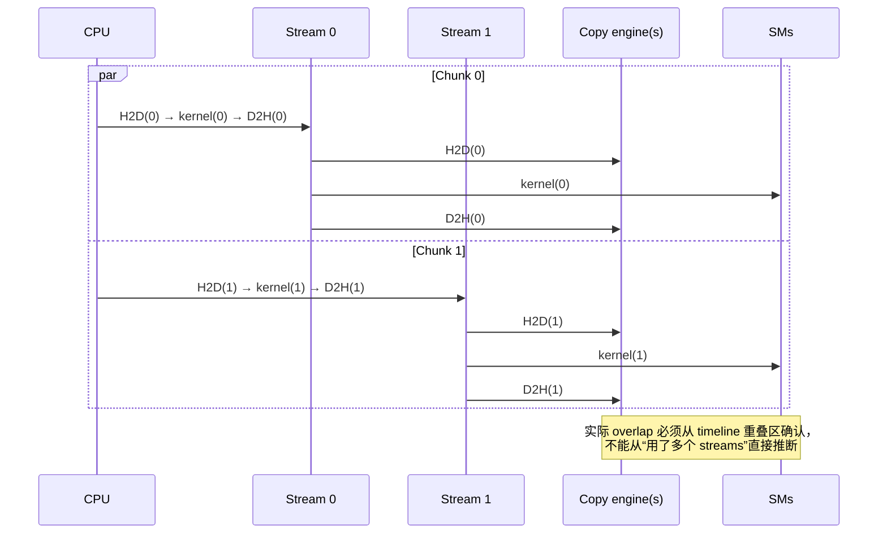
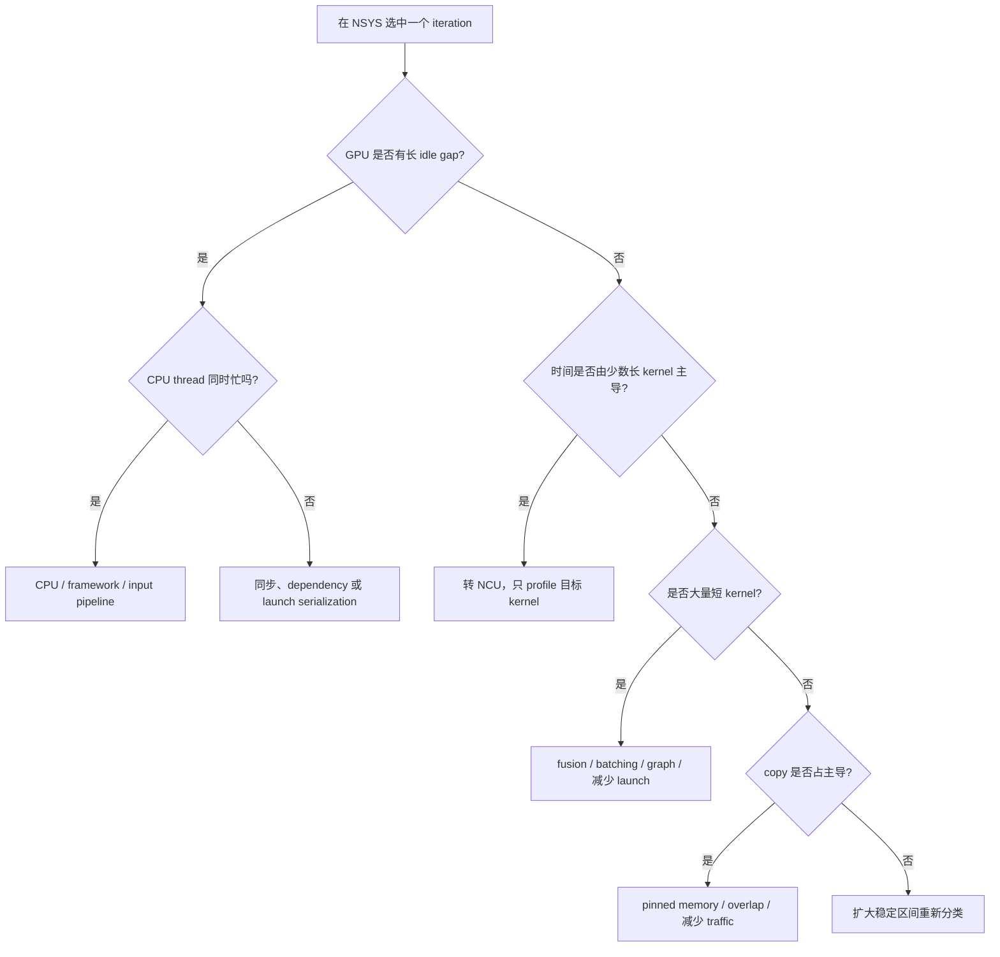

# Nsight Systems：先看整个程序怎么花时间

Nsight Systems（NSYS）回答的是 “什么时候发生了什么、谁在等谁”。它看 CUDA API、CPU threads、GPU streams、memcpy、kernel、library call 与同步关系，不负责解释某条 kernel 指令为什么慢。

## Capture

```bash
./scripts/profile_nsys.sh streams
./scripts/profile_nsys.sh gemm v2

# 打开 GUI
nsys-ui out/streams-all.nsys-rep

# 只看文字摘要
nsys stats out/streams-all.nsys-rep
```

正式报告前把 iterations 调低，避免时间线塞满重复 kernel。若应用很长，使用 capture range / NVTX range，只采稳定 workload。

## 时间线应该怎么看

按这个顺序展开：

1. CPU thread 上的 CUDA Runtime API；
2. GPU → CUDA HW → Context → Streams；
3. Memory copy rows（H2D、D2H、D2D）；
4. Kernel rows；
5. cuBLAS/cuDNN/NVTX ranges；
6. 最后才看 OS runtime 与 CPU scheduling。

```mermaid
sequenceDiagram
  autonumber
  participant CPU as CPU thread
  participant S0 as CUDA stream 0
  participant CE as Copy engine
  participant SM as GPU SMs

  CPU->>S0: cudaMemcpyAsync H2D
  S0->>CE: H2D chunk 0
  CPU->>S0: kernel launch
  CE-->>S0: input ready
  S0->>SM: kernel chunk 0
  CPU->>S0: cudaMemcpyAsync D2H
  SM-->>S0: output ready
  S0->>CE: D2H chunk 0
  Note over CPU,SM: API launch is asynchronous;<br/>stream order creates device dependencies
```

一个 stream 内仍然有顺序。要 overlap，通常需要 pinned host memory、不同 streams、独立数据 chunk，以及硬件 copy/compute resources。



## 五类常见图形

| 时间线现象 | 可能原因 | 下一步 |
|---|---|---|
| CPU API 间有大空洞 | CPU preprocessing、lock、allocation、I/O | 展开 CPU/OS rows；减少 per-iteration host work |
| 大量极短 kernels | launch overhead、算子太碎 | batch、fusion、CUDA Graphs（延伸） |
| `cudaDeviceSynchronize` 很宽 | 前面的 GPU work 才是等待来源 | 向左找到造成等待的 stream/kernel |
| H2D/D2H 与 kernel 完全串行 | pageable memory、default-stream dependency、资源不足 | pinned memory、non-default streams、检查依赖 |
| 多 streams 仍不重叠 | 同一 engine/SM 已饱和、chunk 太大/小、隐式同步 | 查 copy engine 与 kernel utilization，再调 chunks |

## 判断“系统问题还是 kernel 问题”



## Overlap 的四个必要检查

1. host buffer 是 `cudaMallocHost`/pinned，而不是普通 pageable allocation；
2. 使用 `cudaMemcpyAsync`，且 operations 在不同 non-blocking streams；
3. chunks 写入不同 device/host 地址，没有人为 dependency；
4. GPU 有相应 async engine，且 kernel 没占尽所有可并行资源。

本 repo 对应程序是 `src/07_streams.cu`。依次测试 streams=1/2/4、chunks=2/4/8/16，并以 timeline 而非 speedup 数字证明 overlap。
