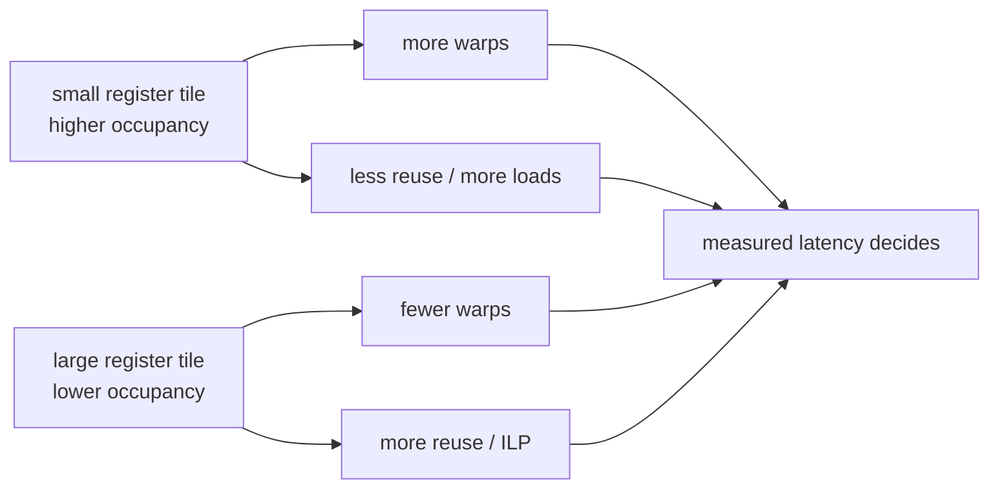

# Occupancy 与 Occupancy Calculator

Occupancy 是 active warps 相对于 SM 最大 warp capacity 的比例。它描述 latency hiding 的潜在供给，不描述每个 warp 的工作效率。

## 资源如何变成 occupancy

```mermaid
flowchart TD
  T[threads / block] --> W[warps / block = ceil(T / 32)]
  R[registers / thread] --> RB[registers / block<br/>含 allocation granularity]
  T --> RB
  SS[static shared / block] --> SB[shared / block]
  DS[dynamic shared / block] --> SB

  W --> LW[warp-slot block limit]
  T --> LT[thread-slot block limit]
  RB --> LR[register block limit]
  SB --> LS[shared-memory block limit]
  MAX[max blocks / SM] --> LM[architectural block limit]

  LW --> RES[resident blocks = min(all limits)]
  LT --> RES
  LR --> RES
  LS --> RES
  LM --> RES
  RES --> AW[active warps = resident blocks × warps/block]
  AW --> OCC[occupancy = active warps / max warps per SM]
```

概念公式：

```text
warps_per_block = ceil(threads_per_block / 32)

resident_blocks = min(
  max_blocks_per_SM,
  floor(max_threads_per_SM / threads_per_block),
  floor(max_warps_per_SM / warps_per_block),
  register_limited_blocks,
  shared_memory_limited_blocks
)

occupancy = resident_blocks × warps_per_block / max_warps_per_SM
```

register/shared allocations 有架构相关 rounding granularity；手算用于理解，最终值看 NCU Occupancy Calculator 或 CUDA occupancy API。

## 一个假想算例

假设某 SM 上限为 2048 threads、64 warps、65536 registers、64 KiB shared、32 blocks：

```text
threads/block       = 256  → 8 warps/block
registers/thread    = 64   → 16384 registers/block（先忽略 rounding）
shared/block        = 16 KiB

thread limit        = floor(2048 / 256) = 8 blocks
warp limit          = floor(64 / 8)      = 8 blocks
register limit      = floor(65536/16384) = 4 blocks
shared limit        = floor(64/16)       = 4 blocks

resident blocks     = min(32, 8, 8, 4, 4) = 4
active warps        = 4 × 8 = 32
theoretical occupancy = 32/64 = 50%
```

如果 register tile 把 registers/thread 从 64 增到 96，register limit 可能降到 2 blocks、occupancy 降到 25%。但若 global/shared loads 显著减少且 ILP 增加，kernel 仍可能更快。



## NCU 里实际怎么做

1. 打开 Occupancy section，记录 theoretical 与 achieved occupancy；
2. 看 limiting factor：registers、shared memory、warps、blocks 还是 barriers；
3. 点 Occupancy Calculator；
4. 只改变 block size、registers/thread 或 dynamic shared 中一个值；
5. Calculator 给的是 residency 预测，不是 latency 预测；
6. 回到实际 build/benchmark 验证，并检查 spill、eligible warps 与 memory traffic。

编译器静态信息：

```bash
cmake -S . -B build/release -G Ninja \
  -DCMAKE_CUDA_FLAGS_RELEASE='-O3 --lineinfo -Xptxas=-v'

./scripts/dump_code.sh gemm
```

## block-size sweep 应记录什么

| Block | Registers/thread | Shared/block | Theoretical occ. | Achieved occ. | Eligible warps | Spill | Latency |
|---:|---:|---:|---:|---:|---:|---:|---:|
| 64 | | | | | | | |
| 128 | | | | | | | |
| 256 | | | | | | | |
| 512 | | | | | | | |

不要为了提高 occupancy 盲目使用 `--maxrregcount`。强压 registers 可能产生 local-memory spill，把问题从“warps 少”变成“每个 warp 多做昂贵 memory work”。
