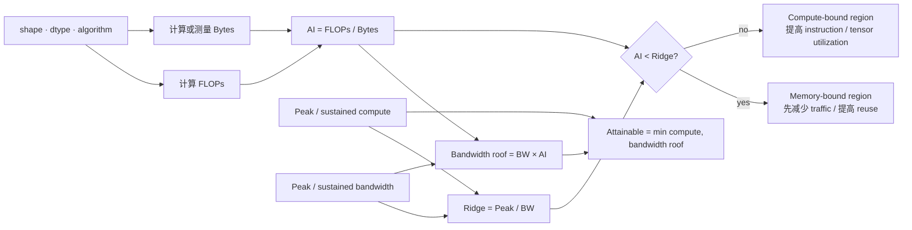
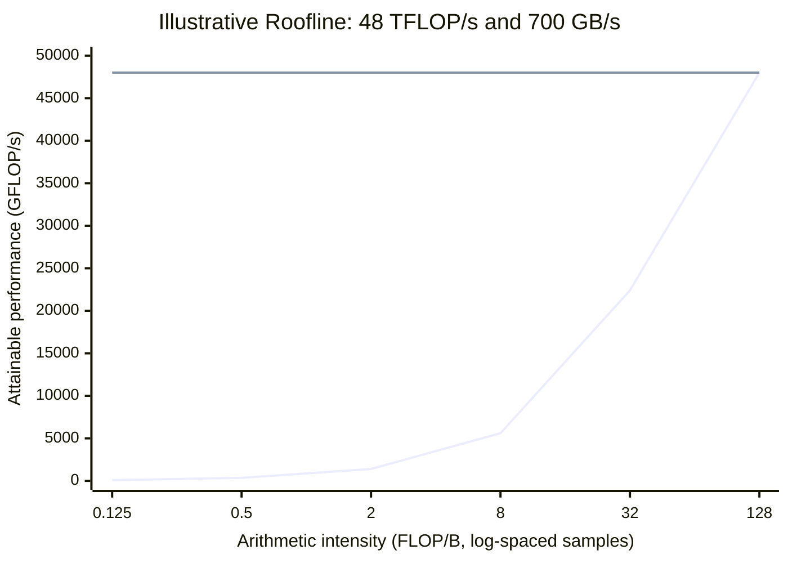
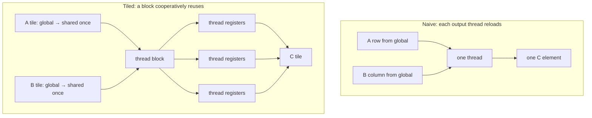
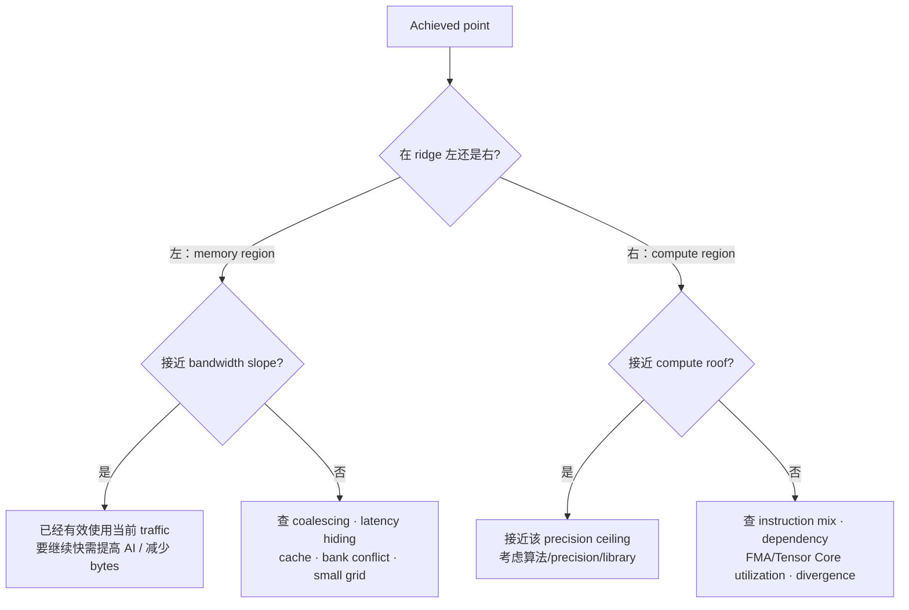

# Roofline：从 FLOPs、bytes 算出优化方向

Roofline 不是用来证明 kernel “已经最好”，而是用来约束可能性：给定 arithmetic intensity 与硬件 ceilings，这个 workload 在当前 traffic 下最多可能达到多少 performance。

## 四条公式

```text
Arithmetic Intensity (AI) = FLOPs / Bytes                    [FLOP/B]
Bandwidth ceiling         = Memory BW × AI                  [FLOP/s]
Attainable performance    = min(Peak compute, BW × AI)      [FLOP/s]
Ridge point               = Peak compute / Memory BW        [FLOP/B]
```



## Roofline 的形状

下面是示意采样：横轴点按近似 log 间距排列；斜线是 `BW × AI`，横线是 compute peak，交点是 ridge。真实分析使用 NCU 的双 log Roofline，而不是从这张示意图读取硬件数值。



## 算子怎么算

### Vector add

`C[i] = A[i] + B[i]`：1 FLOP，读 8 B，写 4 B。

```text
AI = 1 / 12 = 0.0833 FLOP/B
```

它几乎必然在 memory-bound 区域。优化重点是 coalescing、减少额外 traffic、足够并发；`float4` 不会改变算法 AI。

### Reduce sum

对大 N，约 N 次 add、至少读 `4N` bytes，最终写一个 float：

```text
AI ≈ N / (4N + 4) ≈ 0.25 FLOP/B
```

atomic baseline 还有 contention 与 read-modify-write。shared/warp 优化主要减少 atomic 与同步成本，不把 reduce 变成高 AI 算子。

### Naive GEMM 与 tiled GEMM

```text
FLOPs = 2MNK

minimum compulsory bytes = 4(MK + KN + MN)
naive source-requested bytes ≈ 4MN(2K + 1)
```

对 `M=N=K=1024`：

```text
FLOPs                  = 2,147,483,648
minimum bytes          = 12,582,912
best-case algorithm AI ≈ 170.67 FLOP/B
naive-request AI       ≈ 0.25 FLOP/B
```

这就是 tiling 的意义：不是减少 FMA，而是让 A/B 在 shared/register 中重用，使实际 DRAM bytes 朝 minimum traffic 靠近。



### Average Pool

若把 reciprocal multiply 算一 FLOP，K×K window 约 K² FLOPs；direct 版每 output 读 K² floats、写一个：

```text
direct AI ≈ K² / (4(K² + 1)) FLOP/B
```

K=3 时约 0.225 FLOP/B。stride=1 有高度 window overlap，shared tile 能减少重复 DRAM traffic；K=2/S=2 几乎无 window overlap，shared copy+barrier 可能反而更慢。

## 用 repo 计算器

```bash
python3 tools/perf_calculator.py vector-add --n 16777216

python3 tools/perf_calculator.py gemm \
  --m 1024 --n 1024 --k 1024 \
  --traffic-model minimum \
  --peak-tflops 48 --bandwidth-gbps 700 --ms 0.20

python3 tools/perf_calculator.py avg-pool \
  --batches 4 --channels 64 --height 112 --width 112 \
  --kernel 3 --stride 1
```

若 NCU 提供 DRAM read/write bytes，应优先使用测量值：

```bash
python3 tools/perf_calculator.py gemm \
  --m 1024 --n 1024 --k 1024 \
  --dram-read-bytes 250000000 --dram-write-bytes 4194304 \
  --peak-tflops 48 --bandwidth-gbps 700 --ms 0.35
```

注意区分：

- source-requested/logical bytes：从算法与代码估算；
- DRAM bytes：cache hierarchy 之后实际到达 DRAM 的 traffic；
- L1/L2 bytes：另一层 Roofline 需要的 traffic；
- 峰值规格：理论 ceiling；
- sustained bandwidth：用真实 copy benchmark 得到，通常更适合作为实验 roof。

## 如何读 achieved point



point 落在 memory 区不代表 memory system 已饱和；它可能离斜线很远。离哪条 ceiling 多远，决定还有多少同方向优化空间。
