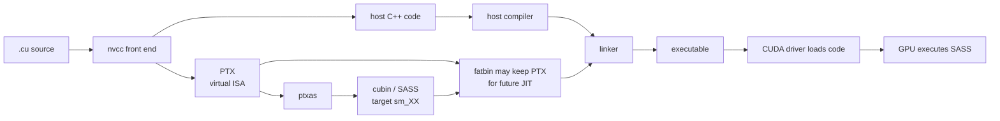
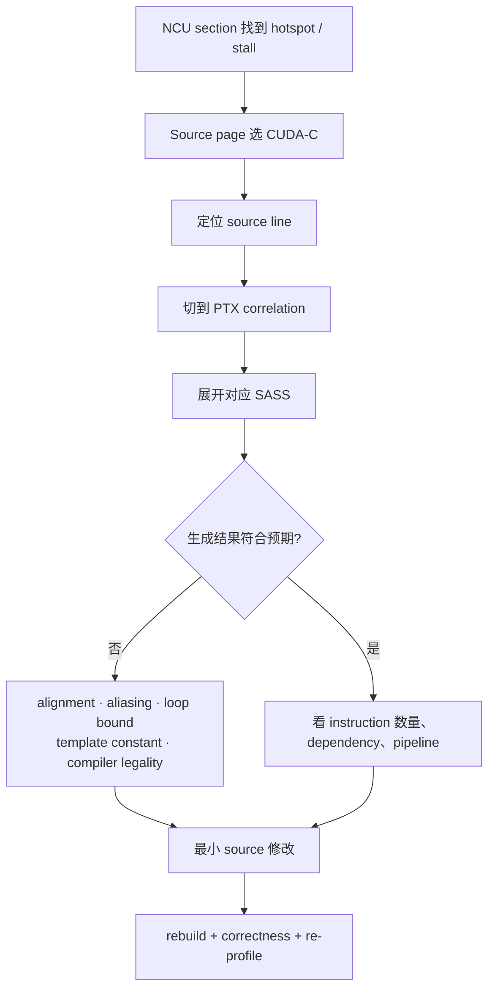
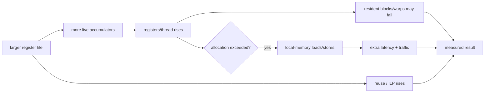

# 从 CUDA C++ 看到 PTX 与 SASS

Source-level 优化要同时理解三层：你写的 CUDA C++、编译器的 PTX virtual ISA、GPU 真正执行的 SASS。PTX 不是最终机器码；确认 vectorization、FMA、spill 或具体 dependency 时，以 SASS 与 NCU Source page 为准。

## 编译链



本 repo 的 Release build 带 `--lineinfo`，用于把 profiler/SASS 映射回 source，但没有 `-G` 的巨大 debug 性能扭曲。

## 三层分别看什么

| 层 | 适合回答 | 不适合单独回答 |
|---|---|---|
| CUDA C++ | mapping、layout、reuse、同步、algorithm traffic | compiler 最终选了什么 machine instruction |
| PTX | address space、barrier、shuffle、load width、virtual registers | 实际 scheduling、最终 register allocation、机器 latency |
| SASS | `LDG/STG`、`FFMA`、`SHFL`、`BAR`、local spill、实际 instruction sequence | 高层算法意图与跨 kernel 系统时间 |

常见概念对应（具体 opcode 会随架构变化）：

| 意图 | CUDA C++ | PTX 常见形态 | SASS 搜索方向 |
|---|---|---|---|
| global load | `input[i]` | `ld.global` | `LDG` |
| global store | `output[i]=x` | `st.global` | `STG` |
| shared load/store | `tile[...]` | `ld.shared` / `st.shared` | `LDS` / `STS` |
| FMA | `a*b+c` | `fma.rn` | `FFMA` |
| barrier | `__syncthreads()` | `bar.sync` | `BAR` |
| warp shuffle | `__shfl_down_sync` | `shfl.sync` | `SHFL` |
| local spill | automatic local access | `ld.local` / `st.local` | local-memory load/store pattern |

## 导出 code 与资源

```bash
./scripts/dump_code.sh reduce_sum

less out/reduce_sum-resources.txt
less out/reduce_sum.ptx
less out/reduce_sum.sass

# 找关键 instruction
rg 'LDG|STG|LDS|STS|FFMA|SHFL|BAR' out/reduce_sum.sass
rg 'ld\.local|st\.local|ld\.global|st\.global|shfl|bar\.sync' out/reduce_sum.ptx
```

resource report 重点看 registers、shared memory、stack frame、spill stores/loads。没有 `ld.local` 不代表一定没有所有 local traffic，最终仍应结合 NCU local-memory metrics 与 SASS。

## NCU Source page 阅读法



### Vectorization 检查

写了 `float4` 只表示你表达了 16-byte 数据结构，不保证所有路径都形成预期的 vector transaction。检查：

1. base pointer 与每一行/plane 的 alignment；
2. index 是否保持 16-byte alignment；
3. tail 是否走独立安全路径；
4. SASS/global transaction metrics 是否真的减少 instruction/request；
5. latency 是否改善；memory ceiling 已满时 instruction 减少可能几乎不改变时间。

### Register pressure / spill 检查



不要只看 PTX virtual register 数量猜 occupancy。用 `launch__registers_per_thread`、resource usage 与 occupancy calculator 看最终 allocation。

## C/C++ 层的固定审查

进入汇编前先回答：

- 这个 pointer 真的是 contiguous/aligned 吗？
- `int` shape multiplication 会 overflow 吗？
- `__restrict__` 的 non-alias promise 是否真实？
- kernel 是否因 runtime loop bound 无法 unroll？
- `__syncthreads()` 是否由所有 block threads 一致到达？
- boundary branch 只影响最后少数 warps，还是每个 warp 都 divergent？
- temporary array 是否因为 dynamic indexing 被放进 local memory？
- 数据 layout 与 leading dimension 是否让 warp address coalesced？

只有 source contract 清楚，PTX/SASS 才能解释，而不是变成 opcode 猜谜。
