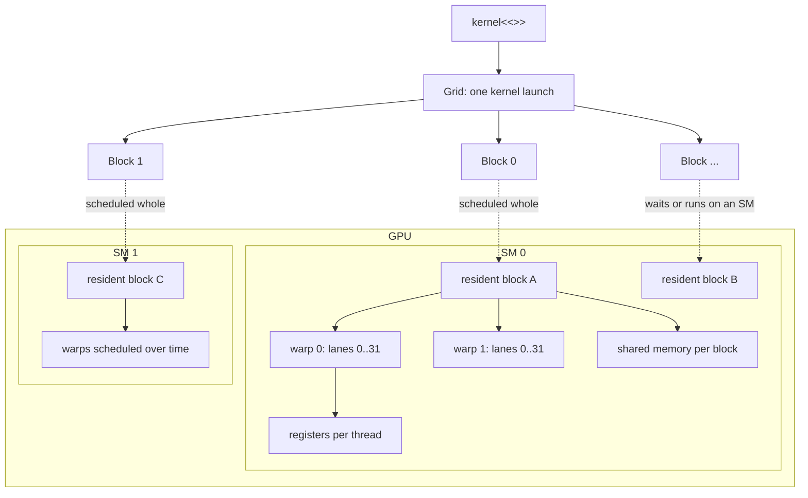
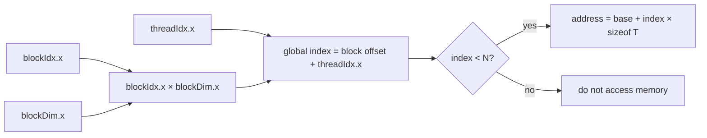
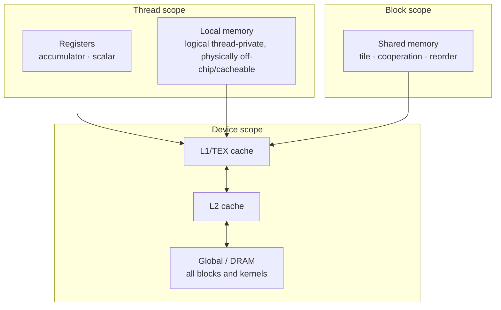
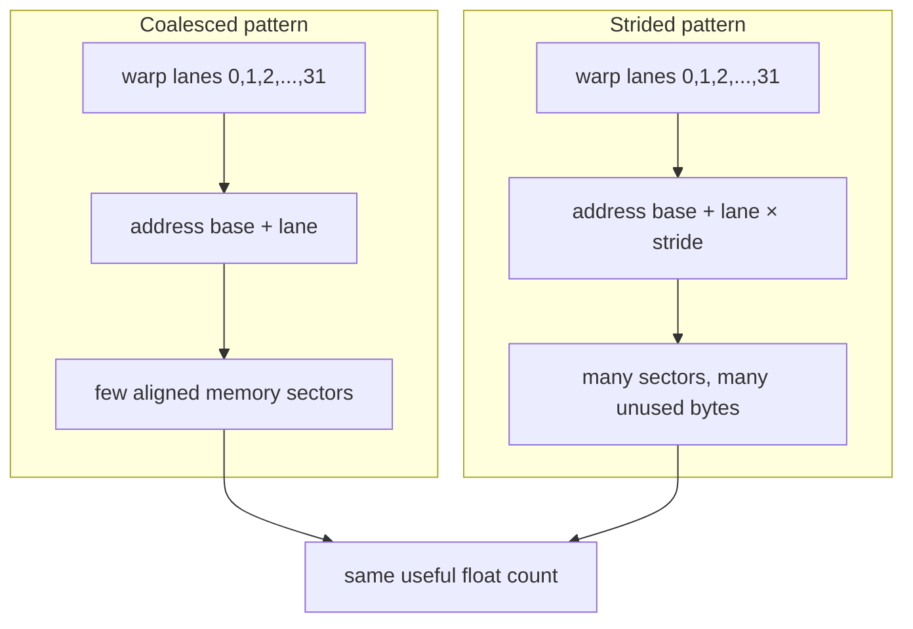
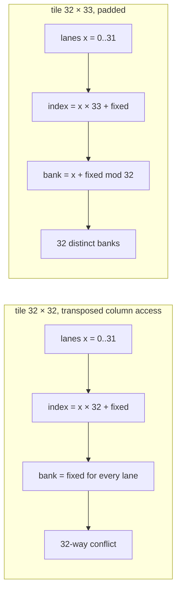
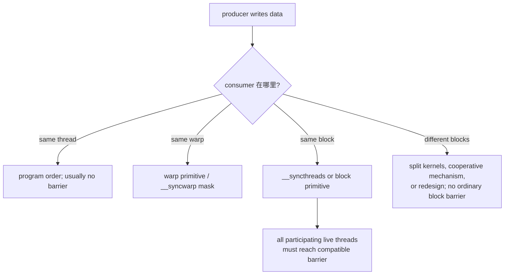
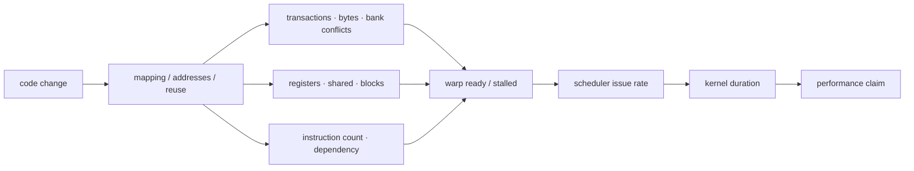

# CUDA 图解：从 thread mapping 到 memory traffic

这份图解先建立空间关系，再进入 profiling。每张图都对应一个必须能手算或在 code 中指出的位置。

## 1. Grid、block、warp、SM



一个 block 只驻留在一个 SM；同一 block 的 threads 才能用普通 shared memory 和 `__syncthreads()` 协作。warp 是 32 个连续 thread IDs 的 scheduling group。

## 2. 一维 index 怎么算



以 `N=100003`、`blockDim=256` 为例：

```text
gridDim = ceil(100003 / 256) = 391 blocks
launched threads = 391 × 256 = 100096
inactive tail threads = 100096 - 100003 = 93
```

tail guard 是 correctness contract；多出的 threads 不是 bug。

## 3. Memory hierarchy 与 scope



这不是严格 latency 比例图。关键是 ownership、scope、capacity 与 traffic：register tile 增加 thread-private reuse；shared tile 增加 block reuse；二者都可能降低 residency。

## 4. Coalescing：warp 地址是否连续



coalescing 是一个 warp 的地址集合属性，不是“用了连续数组”就自动成立。Matrix transpose v0 的 input read 连续，但 output write 以 `height` 为 stride。

## 5. Shared bank conflict 为什么 `+1` 有效

对 32-bit words，可先用 `bank = linear_index mod 32` 建立直觉。



padding 没有改变 global matrix shape；它只改变 shared-memory row stride，让同一个 warp 的 bank index 旋转。

## 6. 同步的范围



barrier 解决 ordering/visibility，不自动解决多个 threads 同时更新同一地址的 race；后者还需要 ownership、reduction 或 atomic。

## 7. 从代码改变到 profiler metric



因此“改成 shared memory”不是解释。完整解释要走完：它如何改变地址/reuse → traffic/resource → ready warps/issue → measured duration。

接下来阅读 [完整 profiling 路线](profiling.md) 和 [算子案例图](profiling/case-studies.md)。
